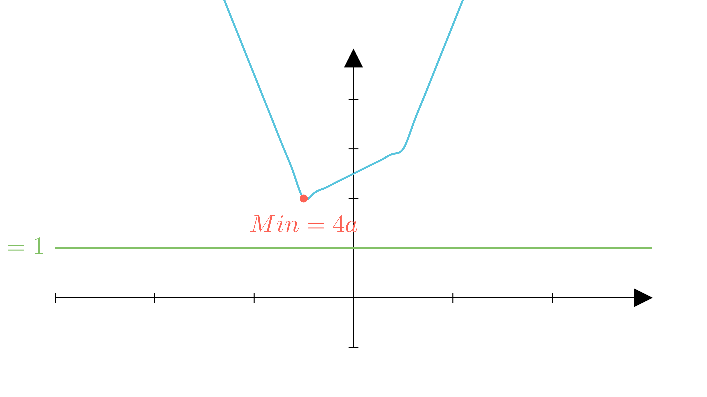

[⬅️ Назад кон Индексот](../../README.md) | [🧰 Skill: logic](../../../tools/skill_guides/logic.md)

# Параметарска равенка со модули

## 📝 Текст на задачата
За кои вредности на параметарот $a \ge 0$ равенката $2|x-a| + 3|x+a| = 1$ има барем едно реално решение?

## 📐 Скица

  

## 🧠 Анализа
**Зошто е оваа задача тешка?**
Разгледајте ја функцијата $f(x) = 2|x-a| + 3|x+a|$. Ова е конвексна функција. Нејзиниот минимум се достигнува во една од точките каде што изразите во модулите се нула ($x=a$ или $x=-a$). Најдете го минимумот на функцијата $m(a)$. За да има решение равенката $f(x)=1$, мора $m(a) \le 1$.

**Конструктивен потег:**
Разгледајте ја функцијата $f(x) = 2|x-a| + 3|x+a|$. Ова е конвексна функција. Нејзиниот минимум се достигнува во една од точките каде што изразите во модулите се нула ($x=a$ или $x=-a$). Најдете го минимумот на функцијата $m(a)$. За да има решение равенката $f(x)=1$, мора $m(a) \le 1$.

## 💡 Решение

??? tip "Чекор 1: Вредност во $x = a$"
    $$ f(a) = 2|a-a| + 3|a+a| = 0 + 3|2a| = 6a $$
    
    (бидејќи $a \ge 0$).

??? tip "Чекор 2: Вредност во $x = -a$"
    $$ f(-a) = 2|-a-a| + 3|-a+a| = 2|-2a| + 0 = 4a $$

??? tip "Чекор 3: Одредување на минимумот"
    Минимумот на функцијата е помалата од овие две вредности. Бидејќи $4a \le 6a$ (за $a \ge 0$), минимумот е $4a$.
    Всушност, функцијата изгледа вака:
    
    *   За $x < -a$: $f(x) = -2(x-a) - 3(x+a) = -5x - a$ (опаѓа)
    *   За $-a < x < a$: $f(x) = -2(x-a) + 3(x+a) = x + 5a$ (расте)
    *   За $x > a$: $f(x) = 2(x-a) + 3(x+a) = 5x + a$ (расте)
    
    Значи, глобалниот минимум е навистина во $x = -a$ и изнесува $4a$.

??? tip "Чекор 4: Услов за решение"
    Равенката $f(x) = 1$ има решение ако и само ако правата $y=1$ го сече графикот на $f(x)$. Ова е можно само ако минимумот на $f(x)$ е помал или еднаков на 1.
    
    $$ \min(f(x)) \le 1 $$
    
    $$ 4a \le 1 $$
    
    $$ a \le \frac{1}{4} $$
    
    Бидејќи е дадено $a \ge 0$, решението е $a \in [0, 0.25]$.

## 🏁 Заклучок
Видете го решението погоре.

## 👩‍🏫 За наставници
Графичката интерпретација е клучна. Функцијата е „корито“ составено од отсечки. За да може да се наполни до ниво 1, дното на коритото мора да е пониско од 1.