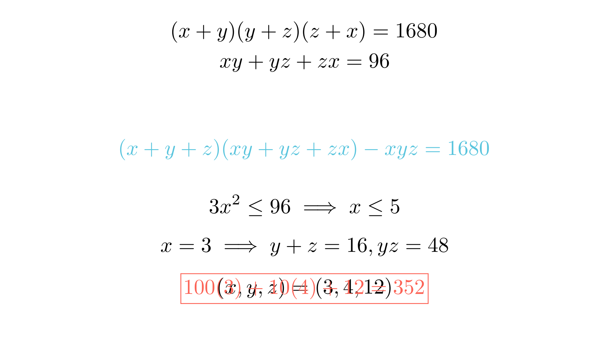

# Минимизација на вредност кај симетричен систем равенки

# Текст на задачата
Даден е системот равенки во множеството на природни броеви:

$$ \begin{cases} (x + y)(y + z)(z + x) = 1680 \\ xy + yz + zx = 96 \end{cases} $$

Најди ја минималната вредност на изразот $100x + 10y + z$.

# 💡 Помош (Hints)

Кликни за мала помош

1. Постои многу корисен алгебарски идентитет за производот на три бинома:

$$(x+y)(y+z)(z+x) = (x+y+z)(xy+yz+zx) - xyz$$

2. Бидејќи равенките се симетрични во однос на $x, y$ и $z$, можеме да претпоставиме дека $x \le y \le z$ за да го ограничиме пребарувањето.

3. Користете ја втората равенка и претпоставката $x \le y \le z$ за да најдете горна граница за $x$. Забележете дека $3x^2 \le xy + yz + zx = 96$.

# Решение
## 🧠 Експертска Анализа (Интуиција)
Овој систем равенки на прв поглед изгледа застрашувачки поради производот на три збира. Сепак, **тригерот** за решението лежи во неговата симетрија. Во математиката на олимписко ниво, симетријата е како мапа која ни кажува дека решенијата се „подредени“.

**Зошто да не користиме супституција веднаш?** Ако се обидеме да изразиме една променлива преку другите, ќе добиеме равенки од трет степен кои се тешки за решавање. Наместо тоа, користиме моќен идентитет кој го поврзува производот на биномите со елементарните симетрични полиноми: збирот $(x+y+z)$, збирот на производите $(xy+yz+zx)$ и производот $(xyz)$.

Откако ќе ја воспоставиме оваа врска, задачата станува Диофантска — бараме природни броеви. Со претпоставката $x \le y \le z$, драстично го намалуваме просторот за пребарување за $x$. Бидејќи $x$ мора да биде мал број ($x^2 \le 32$), имаме само неколку случаи за проверка.

## 📐 Детално Решение

Чекор 1: Примена на симетричниот идентитет

Го користиме идентитетот:

$$(x+y)(y+z)(z+x) = (x+y+z)(xy+yz+zx) - xyz$$

Заменувајќи ги вредностите од системот ($1680$ и $96$), добиваме:

$$1680 = (x+y+z) \cdot 96 - xyz$$

Оваа равенка можеме да ја запишеме како:

$$96(x+y+z) - xyz = 1680$$

Чекор 2: Ограничување на вредноста на $x$

Без губење на општоста, нека $x \le y \le z$. Од втората равенка на системот имаме:

$$96 = xy + yz + zx \ge x^2 + x^2 + x^2 = 3x^2$$

$$3x^2 \le 96 \implies x^2 \le 32$$

Бидејќи $x$ е природен број, следува дека $x \in \{1, 2, 3, 4, 5\}$.

Чекор 3: Анализа по случаи

- **Случај $x=1$:** $y+z+yz = 96-1(y+z) = 96 - y - z$. Системот не дава целобројни решенија.
- **Случај $x=2$:** $2y+2z+yz = 96$. Слично, нема решенија во природни броеви.
- **Случај $x=3$:**
Од втората равенка: $3y + 3z + yz = 96 \implies 3(y+z) + yz = 96 \implies y+z = \frac{96-yz}{3}$.
Заменуваме во идентитетот од Чекор 1:
$$96(3 + \frac{96-yz}{3}) - 3yz = 1680$$
$$288 + 32(96-yz) - 3yz = 1680$$
$$288 + 3072 - 32yz - 3yz = 1680 \implies 3360 - 35yz = 1680$$
$$35yz = 1680 \implies yz = 48$$
Сега наоѓаме $y+z = \frac{96-48}{3} = 16$.
Броевите $y$ и $z$ се корени на равенката $t^2 - 16t + 48 = 0$, односно $(t-4)(t-12)=0$.
Добиваме $y=4$ и $z=12$.

Чекор 4: Минимизација на изразот

Решението на системот е тројката $(3, 4, 12)$ и сите нејзини пермутации. Ние бараме минимална вредност на $100x + 10y + z$.
За да го минимизираме овој израз, треба стотките ($x$) да бидат што е можно помали, а потоа и десетките ($y$).

Можни вредности за $(x, y, z)$ се:
- $(3, 4, 12) \implies 100(3) + 10(4) + 12 = 352$
- $(3, 12, 4) \implies 100(3) + 10(12) + 4 = 424$
- $(4, 3, 12) \implies 100(4) + 10(3) + 12 = 442$
- ... (останатите ќе бидат поголеми бидејќи $x$ ќе биде 4 или 12)

Минималната вредност е $352$.

**Краен одговор:** $\boxed{352}$

---

## Илустрација

## 👨‍🏫 Менторски Белешки
1.  **Златен Совет:** Кај симетрични системи во природни броеви, секогаш воведувајте подреденост $x \le y \le z$. Ова е најбрзиот начин да се „скрши“ симетријата и да се дојде до конечен број случаи за проверка.
2.  **Чести Грешки:** Учениците често забораваат да ги проверат сите пермутации за финалниот израз. Иако $x, y, z$ се симетрични во почетниот систем, тие **не се симетрични** во изразот $100x + 10y + z$.
3.  **Зошто ова е важно:** Оваа задача учи на комбинирање на алгебарски идентитети со теорија на броеви (Диофантски пристап), што е клучно за средношколските натпревари.

### 🔗 Поврзани вештини
* **Примарна вештина:** Решавање системи равенки во природни броеви
* **Потребни предзнаења:** Симетрични полиноми, Виетови формули (за квадратна равенка).