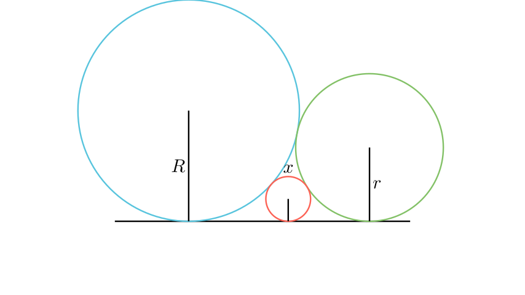

# Третата кружница (Сангаку)

## 📝 Текст на задачата
Две кружници со радиуси $R$ и $r$ се допираат една со друга однадвор и истовремено ја допираат една права $t$. Во просторот помеѓу нив е впишана трета, помала кружница со радиус $x$, која ги допира двете големи кружници и правата. Докажи ја релацијата:
$$ \frac{1}{\sqrt{x}} = \frac{1}{\sqrt{R}} + \frac{1}{\sqrt{r}} $$

---

## 📐 Скица

{ width=500 }

## 🧠 Анализа (Геометриска Интуиција)
<!-- Овој текст ќе биде скриен зад копче "💡 Прикажи помош" -->

💡 Прикажи помош (Анализа)

Искористи ја формулата за должина на заедничка надворешна тангента меѓу две кружници што се допираат: $d = 2\sqrt{R_1 R_2}$. Примени ја оваа формула три пати: за парот $(R, r)$, за парот $(R, x)$ и за парот $(r, x)$. Збирот на помалите отсечки мора да биде еднаков на големата.

---

## 📐 Решение
<!-- Овој текст ќе биде скриен зад копче "📝 Прикажи решение" -->
<Детално решение, чекор по чекор. Користи "Синтетичка геометрија" (агли, складност) освен ако не е наведено поинаку.>

**Краен одговор:** 

---

## 👨‍🏫 Педагошки белешки
Оваа задача е прекрасен пример за поврзување на геометрија и алгебра. Често се користи за вовед во 'Инверзија', но овој доказ со Питагора е поелементарен и поразбирлив за ученици.

---

### 🔗 Поврзани вештини
*   **Примарна вештина:** [metric_relations](../../skill_guides/metric_relations.md)
*   **Потребни предзнаења:**
  - basic_math