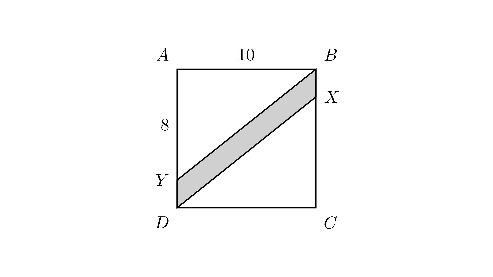

[⬅️ Назад кон Индексот](../../README.md) | [🧰 Skill: area_method](../../../tools/skill_guides/area_method.md)

# Плоштина на шрафиран дел во квадрат

## 📝 Текст на задачата
На дадениот цртеж, $ABCD$ е квадрат со страна 10. Ако $AY = CX = 8$, пресметај ја плоштината на шрафираниот дел (паралелограмот $XBYD$).

## 📐 Скица

> **👨‍💻 Geo-Mentor Code:**
> Одете во `assets/manim_code_log.md`, копирајте го кодот за `Task_2022_mun_y2_1b` и генерирајте ја сликата.

> **👨‍💻 Geo-Mentor Code:**
> Одете во `assets/manim_code_log.md`, копирајте го кодот за `Task_2022_mun_y2_1b` и генерирајте ја сликата.

## 🧠 Анализа
**Зошто е оваа задача тешка?**
Од плоштината на целиот квадрат одземи ги плоштините на двата правоаголни триаголници $\triangle ABY$ и $\triangle CDX$.

**Конструктивен потег:**
Од плоштината на целиот квадрат одземи ги плоштините на двата правоаголни триаголници $\triangle ABY$ и $\triangle CDX$.

## 💡 Решение

👀 Прикажи го решението

**Чекор 1: Димензии**
Страна на квадратот $a = 10$. Плоштина $P_{sq} = 100$.
Дадено е $AY = 8$. Бидејќи $Y$ лежи на $AD$, тогаш $DY = AD - AY = 10 - 8 = 2$.
Дадено е $CX = 8$. Бидејќи $X$ лежи на $BC$, тогаш $BX = BC - CX = 10 - 8 = 2$.

**Чекор 2: Плоштина на триаголниците**
Шрафираниот дел е опколен со два правоаголни триаголници:
1. $\triangle ABY$ (со катети $AB=10$ и $AY=8$).
   $$ P_1 = \frac{10 \cdot 8}{2} = 40 $$
2. $\triangle CDX$ (со катети $CD=10$ и $CX=8$).
   $$ P_2 = \frac{10 \cdot 8}{2} = 40 $$

**Чекор 3: Плоштина на шрафираниот дел**
$$ P_{shaded} = P_{sq} - (P_1 + P_2) $$
$$ P_{shaded} = 100 - (40 + 40) = 100 - 80 = 20 $$

**Одговор:** 20.

## 🏁 Заклучок
<Краен резултат.>

## 👩‍🏫 За наставници
Внимавајте кои отсечки се дадени ($AY$ и $CX$), а кои се потребни за триаголниците.