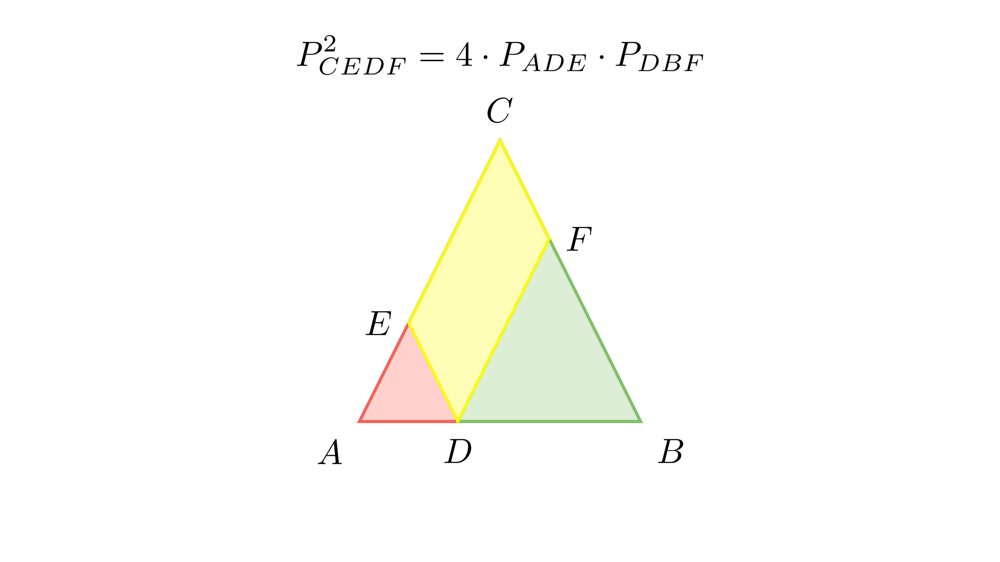

[⬅️ Назад кон Индексот](../../README.md) | [🧰 Skill: visual_reasoning](../../../tools/skill_guides/visual_reasoning.md)

# Плоштини и паралелни прави

## 📝 Текст на задачата
На страната $AB$ на $\triangle ABC$ избрана е точка $D$. Права низ $D$ паралелна со $BC$ ја сече $AC$ во $E$. Права низ $D$ паралелна со $AC$ ја сече $BC$ во $F$. Докажи дека $P_{CEDF}^2 = 4 \cdot P_{ADE} \cdot P_{DBF}$.

## 📐 Скица

> **👨‍💻 Geo-Mentor Code:**
> Одете во `assets/manim_code_log.md`, копирајте го кодот за `Task_2023_mun_y2_3ab` и генерирајте ја сликата.

> **👨‍💻 Geo-Mentor Code:**
> Одете во `assets/manim_code_log.md`, копирајте го кодот за `Task_2023_mun_y2_3ab` и генерирајте ја сликата.

## 🧠 Анализа
**Зошто е оваа задача тешка?**
Четириаголникот $CEDF$ е паралелограм. Триаголниците $\triangle ADE$ и $\triangle DBF$ се слични со $\triangle ABC$. Означете го односот на сличност за првиот со $k_1 = AD/AB$, а за вториот со $k_2 = DB/AB$. Тогаш $k_1 + k_2 = 1$. Плоштините се однесуваат како квадратите на коефициентите.

**Конструктивен потег:**
Четириаголникот $CEDF$ е паралелограм. Триаголниците $\triangle ADE$ и $\triangle DBF$ се слични со $\triangle ABC$. Означете го односот на сличност за првиот со $k_1 = AD/AB$, а за вториот со $k_2 = DB/AB$. Тогаш $k_1 + k_2 = 1$. Плоштините се однесуваат како квадратите на коефициентите.

## 💡 Решение

👀 Прикажи го решението

**Чекор 1: Сличност**
Нека $P$ е плоштината на $\triangle ABC$.
$\triangle ADE \sim \triangle ABC$ со коефициент $k_1 = \frac{AD}{AB}$. Значи $P_{ADE} = k_1^2 P$.
$\triangle DBF \sim \triangle ABC$ со коефициент $k_2 = \frac{DB}{AB}$. Значи $P_{DBF} = k_2^2 P$.
Важи $k_1 + k_2 = \frac{AD+DB}{AB} = 1$.

**Чекор 2: Плоштина на паралелограмот**
$P_{CEDF} = P - P_{ADE} - P_{DBF} = P - k_1^2 P - k_2^2 P = P(1 - k_1^2 - k_2^2)$.
Бидејќи $1 = (k_1+k_2)^2 = k_1^2 + 2k_1k_2 + k_2^2$, имаме:
$1 - k_1^2 - k_2^2 = 2k_1k_2$.
Значи $P_{CEDF} = 2k_1k_2 P$.

**Чекор 3: Доказ на равенството**
Лева страна: $P_{CEDF}^2 = (2k_1k_2 P)^2 = 4 k_1^2 k_2^2 P^2$.
Десна страна: $4 P_{ADE} P_{DBF} = 4 (k_1^2 P) (k_2^2 P) = 4 k_1^2 k_2^2 P^2$.

Левата и десната страна се еднакви.

## 🏁 Заклучок
<Краен резултат.>

## 👩‍🏫 За наставници
Користењето на коефициенти на сличност ($k$) наместо должини на страни го прави доказот многу поелегантна и пократок.