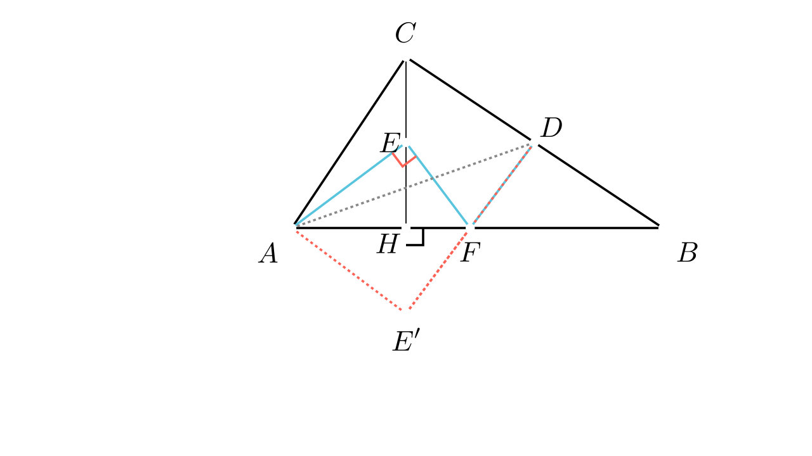

# Аголот $\angle AEF$ преку симетрија

<!-- Ова место е резервирано за автоматската слика од Manim -->

## 📝 Текст на задачата
Во правоаголниот триаголник $ABC$ на хипотенузата $AB$ е спуштена висината $CH$. На страната $BC$ избрана е точка $D$, на отсечката $CH$ точка $E$, а на отсечката $BH$ точка $F$ такви што $\angle CAD = \angle BAE$ и $\angle EFA = \angle BFD$. Докажи дека $\angle AEF = 90^\circ$.

---

## 🧠 Анализа (Геометриска Интуиција)
<!-- Овој текст ќе биде скриен зад копче "💡 Прикажи помош" -->

Hint Прикажи помош (Анализа)

Условот $\angle EFA = \angle BFD$ е многу сугестивен. Тој потсетува на законот за одбивање на светлината (упаден агол е еднаков на одбиен агол). Ова сугерира дека правата $AB$ е „огледало“. 

Што ако ја пресликаме точката $E$ симетрично во однос на правата $AB$ во точка $E'$? 
Тогаш $E, F, E'$ ќе бидат колинеарни? Не баш, но аглите ќе се пренесат. 
Обидете се да докажете дека четириаголникот $AE'DC$ е тетивен. Кои агли се еднакви таму?

**Стратегија:**
1. Конструирај точка $E'$ симетрична на $E$ во однос на правата $AB$.
2. Искористи ја симетријата за да покажеш дека $D, F, E'$ се колинеарни (лежат на иста права).
3. Докажи дека четириаголникот $AE'DC$ е тетивен користејќи еднаквост на агли.
4. Искористи го својството на тетивен четириаголник за да го пресметаш аголот $\angle AE'D$.
5. Врати се назад преку симетријата за да го најдеш $\angle AEF$.

---

## 📐 Решение
<!-- Овој текст ќе биде скриен зад копче "📝 Прикажи решение" -->

Solution Прикажи го целото решение

Нека $\angle BAC = \alpha$. Дадено е дека $\angle CAD = \angle BAE$. 

**Чекор 1: Симетрија**
Нека $E'$ е точка симетрична на $E$ во однос на правата $AB$. 
Бидејќи $E$ лежи на висината $CH$ (која е нормална на $AB$), точката $E'$ ќе лежи на продолжението на $CH$ преку $H$. 
Триаголниците $\triangle AEF$ и $\triangle AE'F$ се складни (симетрични во однос на $AB$). Од ова следи:
1. $\angle EFA = \angle E'FA$
2. $\angle AEF = \angle AE'F$
3. $\angle BAE = \angle BAE'$

**Чекор 2: Колинеарност**
Дадено е дека $\angle EFA = \angle BFD$. 
Од симетријата имаме $\angle EFA = \angle E'FA$. 
Значи, $\angle E'FA = \angle BFD$. 
Бидејќи $F$ лежи на $AB$, а $E'$ и $D$ се наоѓаат на спротивни страни од правата $AB$ (бидејќи $E$ е „горе“ на $CH$, па $E'$ е „долу“, а $D$ е на $BC$ што е „горе“... чекај. $D$ е на $BC$. $C$ е горе. Значи $D$ е горе. $E'$ е долу. Значи $E'$ и $D$ се на спротивни страни). 
Бидејќи вертикалните агли се еднакви ($\angle E'FA$ и $\angle BFD$), точките $E', F, D$ лежат на една права. 
**Заклучок:** $D-F-E'$ е права линија.

**Чекор 3: Тетивен четириаголник**
Да го разгледаме аголот $\angle E'AD$. 
$$ \angle E'AD = \angle E'AB + \angle BAD $$
Од симетријата, $\angle E'AB = \angle EAB$. 
Дадено е дека $\angle EAB = \angle CAD$. 
Значи:
$$ \angle E'AD = \angle CAD + \angle BAD = \angle BAC = \alpha $$

Сега да го видиме аголот $\angle E'CD$. 
Точките $C, H, E, E'$ лежат на иста права (висината). Значи правата $CE'$ е всушност правата на висината. 
Чекај, ова не ни помага директно за аголот $\angle E'CD$. 

Ајде да го видиме четириаголникот $AE'DC$. 
Страната $DE'$ се гледа од темето $A$ под агол $\alpha$ (докажавме $\angle E'AD = \alpha$). 
Страната $DE'$ се гледа од темето $C$... чекај. 
Аголот $\angle E'CD$ е всушност аголот помеѓу висината $CH$ и страната $BC$. 
Во правоаголен триаголник $ABC$ (со прав агол кај $C$ - чекај, задачата вели „правоаголен триаголник $ABC$ на хипотенузата $AB$“. Значи правиот агол е кај $C$). 
Аголот меѓу висината $CH$ и катетата $BC$ е еднаков на аголот $\alpha$ (бидејќи $\triangle CHB \sim \triangle CAB$). 
Значи:
$$ \angle E'CD = \angle HCB = \angle A = \alpha $$

Имаме:
1. $\angle E'AD = \alpha$
2. $\angle E'CD = \alpha$

Бидејќи отсечката $E'D$ се гледа под ист агол од точките $A$ и $C$, четириаголникот $AE'DC$ е **тетивен**.

**Чекор 4: Пресметка на аголот**
Бидејќи $AE'DC$ е тетивен, збирот на спротивните агли е $180^\circ$ (или надворешниот е еднаков на внатрешниот спротивен). 
Но, уште поважно, аглите над иста тетива се еднакви. 
Ајде да го искористиме аголот $\angle AC D = 90^\circ$. 
Тогаш $\angle AE'D + \angle ACD = 180^\circ$? Не, ова важи само ако се спротивни. 
Дали се спротивни? Редоследот на точките на кружницата е $A, C, D, E'$. 
Аглите $\angle ACD$ и $\angle AE'D$ се спротивни. 
Бидејќи $\angle ACD = \angle ACB = 90^\circ$, следи дека:
$$ \angle AE'D = 180^\circ - 90^\circ = 90^\circ $$

**Чекор 5: Враќање назад**
Бидејќи $D, F, E'$ се колинеарни, аголот $\angle AE'D$ е исто што и $\angle AE'F$. 
Значи $\angle AE'F = 90^\circ$. 
Од симетријата (Чекор 1), знаеме дека $\angle AEF = \angle AE'F$. 
Следи:
$$ \angle AEF = 90^\circ $$

Доказот е завршен.

**Краен одговор:** 

---

## 👨‍🏫 Педагошки белешки
1.  **Рефлексијата како алатка:** Ова е школски пример каде „излегувањето од рамнината“ (или поточно, пресликувањето на другата страна) го решава проблемот. Кога имате еднаквост на агли во однос на некоја права ($\angle EFA = \angle BFD$), тоа е *секогаш* повик за рефлексија.
2.  **Тетивност:** Препознавањето на тетивниот четириаголник е клучно. Условот „отсечка се гледа под ист агол“ е еден од најчестите начини да се докаже тетивност. Овде, тоа што $\angle HCB = \angle A$ е стандардно својство на висината во правоаголен триаголник, кое учениците мора да го знаат напамет.
3.  **Визуелизација:** Нацртајте ја кружницата околу $AE'DC$. Дијаметарот на оваа кружница е всушност $AD$, бидејќи аголот кај $C$ е прав? Не, аголот кај $C$ е прав, па $AD$ е дијаметар. Тогаш и аголот кај $E'$ мора да биде прав (агол над дијаметар). Ова е уште подиректен начин да се види крајот.

---

### 🔗 Поврзани вештини
*   **Примарна вештина:** [geometric_transformations](../../skill_guides/geometric_transformations.md)
*   **Потребни предзнаења:**
  - properties_of_reflection
  - cyclic_quadrilateral_properties
  - angles_in_triangle