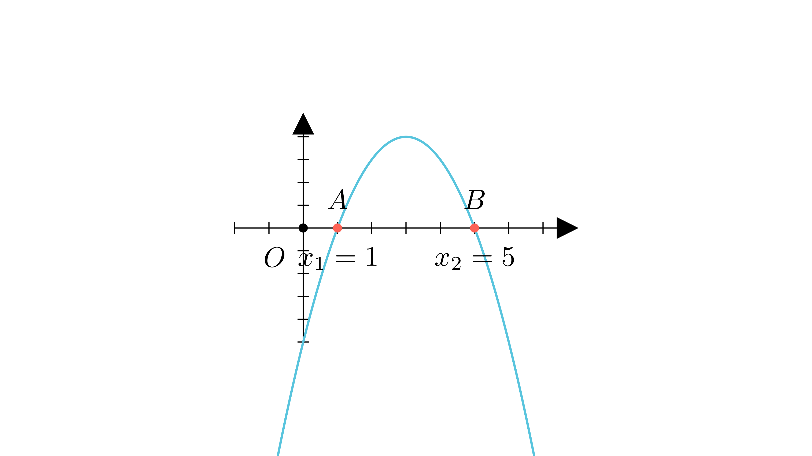

[⬅️ Назад кон Индексот](../README.md) | [🧰 Skill: vieta_formulas](../../skill_guides/vieta_formulas.md)

# Параметар во парабола

## 📝 Текст на задачата
Дадена е параболата $y = -x^2 + 6x + 3m - 9$, за чии пресечни точки со $x$-оската $A$ и $B$ важи $5 \cdot OA = OB$ (каде $O$ е координатниот почеток). Одреди ја вредноста на параметарот $m$.

## 📐 Скица

  

## 🧠 Анализа
**Зошто е оваа задача тешка?**
Точките $A$ и $B$ се корените $x_1, x_2$. Бидејќи темето е во $x=3$ (позитивно), корените се симетрични околу 3. Условот $5 \cdot OA = OB$ значи $x_2 = 5x_1$ (ако се позитивни).

**Конструктивен потег:**
Точките $A$ и $B$ се корените $x_1, x_2$. Бидејќи темето е во $x=3$ (позитивно), корените се симетрични околу 3. Условот $5 \cdot OA = OB$ значи $x_2 = 5x_1$ (ако се позитивни).

## 💡 Решение

??? success "👀 Прикажи го решението"
    Равенката е $-x^2 + 6x + (3m-9) = 0$, или $x^2 - 6x - (3m-9) = 0$.
    Корените се $x_1$ и $x_2$ (апсцисите на $A$ и $B$).
    
    1. **Виетови формули:**
       $x_1 + x_2 = 6$
       $x_1 x_2 = -(3m-9) = 9 - 3m$
    
    2. **Услов од задачата:**
       $5 \cdot OA = OB$. Бидејќи збирот е позитивен (6), претпоставуваме дека корените се позитивни (или барем $B$ е позитивен).
       Ако $x_1, x_2 > 0$, тогаш $x_2 = 5x_1$ (бидејќи $B$ е подалеку).
       
       Заменуваме во збирот:
       $x_1 + 5x_1 = 6 \implies 6x_1 = 6 \implies x_1 = 1$.
       Тогаш $x_2 = 5$.
    
    3. **Наоѓање на $m$:**
       Заменуваме во производот:
       $1 \cdot 5 = 9 - 3m$
       $5 = 9 - 3m$
       $3m = 4$
       $m = \frac{4}{3}$
    
    **Одговор:** $4/3$.

## 🏁 Заклучок
Видете го решението погоре.

## 👩‍🏫 За наставници
Секогаш проверувајте дали корените се позитивни. Ако беа со различен знак, условот ќе беше $x_2 = -5x_1$.