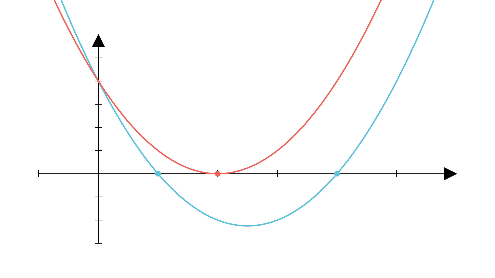

[⬅️ Назад кон Индексот](../README.md) | [🧰 Skill: vieta_formulas](../../skill_guides/vieta_formulas.md)

# Квадратна функција и цели броеви

## 📝 Текст на задачата
За кои вредности на параметарот $k \in \mathbb{N}$, графикот на функцијата $f(x) = x^2 - kx + 4$ ја сече апсцисната оска во точки со координати ненегативни цели броеви помали од 2024?

## 📐 Скица

  

## 🧠 Анализа
**Зошто е оваа задача тешка?**
Пресекот со x-оската значи $f(x)=0$. Бараме $x^2 - kx + 4 = 0$ да има целобројни решенија $x_1, x_2$. Според Виетовите формули, нивниот производ е 4. Бидејќи се цели и ненегативни, има многу малку можности за $x_1, x_2$.

**Конструктивен потег:**
Пресекот со x-оската значи $f(x)=0$. Бараме $x^2 - kx + 4 = 0$ да има целобројни решенија $x_1, x_2$. Според Виетовите формули, нивниот производ е 4. Бидејќи се цели и ненегативни, има многу малку можности за $x_1, x_2$.

## 💡 Решение

??? tip "Чекор 1: Виетови формули"
    Нека $x_1, x_2$ се пресечните точки (цели броеви).
    $x_1 + x_2 = k$
    $x_1 \cdot x_2 = 4$

??? tip "Чекор 2: Анализа на производот"
    Бидејќи $x_1, x_2$ се ненегативни цели броеви чиј производ е 4, можни парови $(x_1, x_2)$ се:
    1.  $(1, 4)$
    2.  $(2, 2)$
    3.  $(4, 1)$

??? tip "Чекор 3: Наоѓање на $k$"
    *   За $(1, 4)$: $k = 1 + 4 = 5$.
    *   За $(2, 2)$: $k = 2 + 2 = 4$.

??? tip "Чекор 4: Проверка на условот"
    Условот е $x < 2024$. Нашите решенија се 1, 2, 4. Сите се помали од 2024.
    
    **Одговор:** Можните вредности за $k$ се 4 и 5.

## 🏁 Заклучок
Видете го решението погоре.

## 👩‍🏫 За наставници
Задачата изгледа страшно поради „2024“, но тоа е само одвлекување на вниманието. Ограничувањето доаѓа од слободниот член 4.