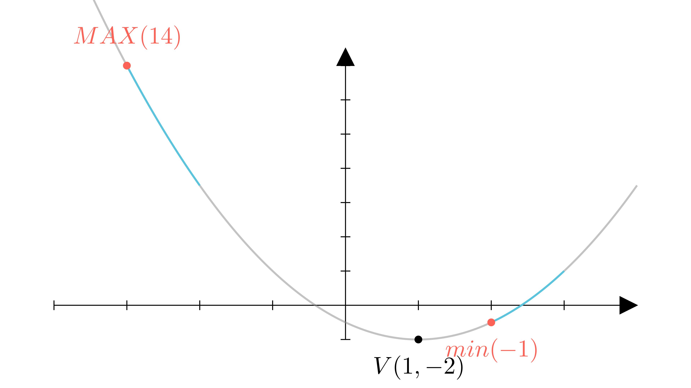

[⬅️ Назад кон Индексот](../../README.md) | [🧰 Skill: logic](../../../tools/skill_guides/logic.md)

# Екстреми на функција со ограничен домен

## 📝 Текст на задачата
Нека функцијата $f(x) = x^2 - 2x - 1$ е зададена на множеството $D = \{x \in \mathbb{R} | x^4 - 13x^2 + 36 \le 0\}$. Одреди ги најмалата и најголемата вредност на функцијата $f$.

## 📐 Скица

> **👨‍💻 Geo-Mentor Code:**
> Одете во `assets/manim_code_log.md`, копирајте го кодот за `Task_2025_mun_y3_3a` и генерирајте ја сликата.

## 🧠 Анализа
**Зошто е оваа задача тешка?**
Прво мора да го најдете доменот $D$. Неравенката е биквадратна ($t = x^2$). Откако ќе ги најдете интервалите за $x$, анализирајте ја квадратната функција $f(x)$ на тие интервали. Внимавајте каде е темето на параболата.

**Конструктивен потег:**
Прво мора да го најдете доменот $D$. Неравенката е биквадратна ($t = x^2$). Откако ќе ги најдете интервалите за $x$, анализирајте ја квадратната функција $f(x)$ на тие интервали. Внимавајте каде е темето на параболата.

## 💡 Решение

👀 Прикажи го решението

**Чекор 1: Одредување на доменот D**
Решаваме $x^4 - 13x^2 + 36 \le 0$. Смена $t = x^2 \ge 0$.

$$ t^2 - 13t + 36 \le 0 $$

Корените се $t_1 = 4, t_2 = 9$. Решението е $4 \le t \le 9$.
Враќаме во $x$:

$$ 4 \le x^2 \le 9 $$

Ова значи $2 \le |x| \le 3$, што дава два интервали:

$$ D = [-3, -2] \cup [2, 3] $$

**Чекор 2: Анализа на функцијата**
$f(x) = x^2 - 2x - 1$. Ова е парабола свртена нагоре.
Темето е во $x_v = -\frac{-2}{2} = 1$.
Бидејќи $x=1 \notin D$, екстремите мора да се на краевите на интервалите.

**Чекор 3: Проверка на краевите**
Интервалите се лево и десно од темето.

*   За $D_1 = [2, 3]$ (десно од темето, функцијата расте):
    $f(2) = 4 - 4 - 1 = -1$
    $f(3) = 9 - 6 - 1 = 2$

*   За $D_2 = [-3, -2]$ (лево од темето, функцијата опаѓа):
    $f(-2) = 4 + 4 - 1 = 7$
    $f(-3) = 9 + 6 - 1 = 14$

**Чекор 4: Заклучок**
Најмала вредност е $m = -1$ (во $x=2$).
Најголема вредност е $M = 14$ (во $x=-3$).

## 🏁 Заклучок
<Краен резултат.>

## 👩‍🏫 За наставници
Најчеста грешка е да се најде темето ($x=1$) и да се мисли дека тоа е минимумот, без да се провери дали припаѓа на доменот.