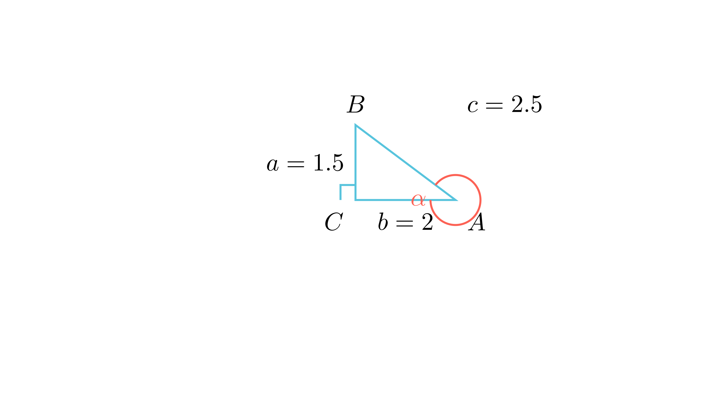

[⬅️ Назад кон Индексот](../README.md) | [🧰 Skill: trigonometry](../../skill_guides/trigonometry.md)

# Периметар на правоаголен триаголник

## 📝 Текст на задачата
Најди го периметарот на правоаголниот триаголник $ABC$ ($\angle C = 90^\circ$), ако се знае дека катетата $AC = 2$ и $\tan \alpha = \frac{3}{4}$.

## 📐 Скица

{ width=500 }
## 🧠 Анализа
**Зошто е оваа задача тешка?**
Искористи ја дефиницијата за тангенс: $\tan \alpha = \frac{a}{b}$. Бидејќи $b=AC=2$, можеш да ја најдеш катетата $a$. Потоа најди ја хипотенузата со Питагора.

**Конструктивен потег:**
Искористи ја дефиницијата за тангенс: $\tan \alpha = \frac{a}{b}$. Бидејќи $b=AC=2$, можеш да ја најдеш катетата $a$. Потоа најди ја хипотенузата со Питагора.

## 💡 Решение

??? tip "Чекор 1: Наоѓање на катетата $a$ ($BC$)"
    Во правоаголен триаголник:
    $$ \tan \alpha = \frac{a}{b} = \frac{BC}{AC} $$
    Дадено е $\tan \alpha = \frac{3}{4}$ и $AC = 2$.
    $$ \frac{a}{2} = \frac{3}{4} \implies a = \frac{3 \cdot 2}{4} = 1,5 $$

??? tip "Чекор 2: Наоѓање на хипотенузата $c$ ($AB$)"
    Според Питагорова теорема:
    $$ c^2 = a^2 + b^2 = (1,5)^2 + 2^2 $$
    $$ c^2 = 2,25 + 4 = 6,25 $$
    $$ c = \sqrt{6,25} = 2,5 $$

??? tip "Чекор 3: Периметар"
    $$ L = a + b + c = 1,5 + 2 + 2,5 = 6 $$
    
    **Одговор:** 6.

## 🏁 Заклучок
Видете го решението погоре.

## 👩‍🏫 За наставници
Ова е триаголник сличен на (3, 4, 5), скалиран со фактор 0.5.