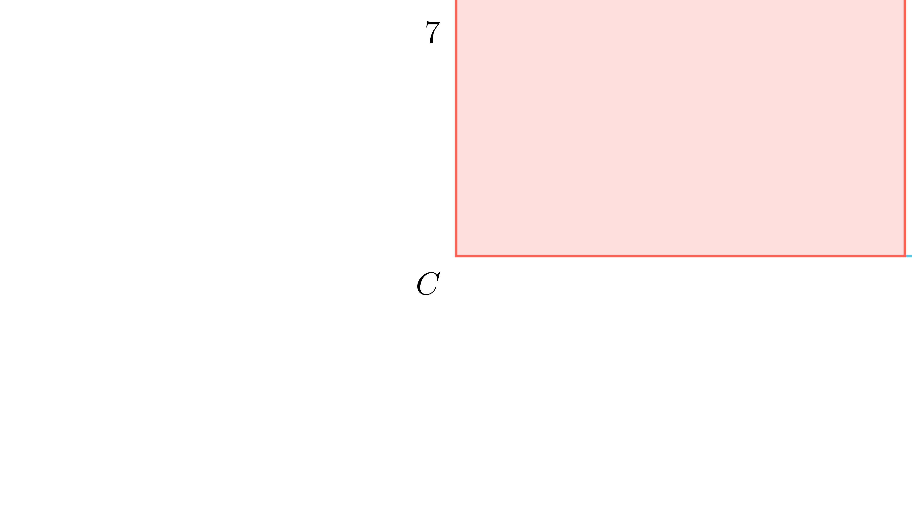

[⬅️ Назад кон Индексот](../README.md) | [🧰 Skill: similarity](../../skill_guides/similarity.md)

# Квадрат во правоаголен триаголник

## 📝 Текст на задачата
Во правоаголен триаголник со хипотенуза со должина 24, впишан е квадрат со страна 7, така што едното теме на квадратот се совпаѓа со темето на правиот агол на триаголникот. Колку е плоштината на правоаголниот триаголник?

## 📐 Скица

{ width=500 }
## 🧠 Анализа
**Зошто е оваа задача тешка?**
Користи ја врската $1/a + 1/b = 1/x$ и $a^2+b^2=c^2$.

**Конструктивен потег:**
Користи ја врската $1/a + 1/b = 1/x$ и $a^2+b^2=c^2$.

## 💡 Решение

??? success "👀 Прикажи го решението"
    Нека катетите се $a$ и $b$. Хипотенузата е $c=24$. Страната на квадратот е $x=7$.
    Важи релацијата за квадрат впишан во прав агол:
    $$ \frac{1}{a} + \frac{1}{b} = \frac{1}{x} \implies \frac{a+b}{ab} = \frac{1}{7} \implies ab = 7(a+b) $$
    
    Плоштината е $P = \frac{ab}{2} \implies ab = 2P$.
    Значи $2P = 7(a+b) \implies a+b = \frac{2P}{7}$.
    
    Од Питагорова теорема:
    $$ a^2 + b^2 = c^2 = 24^2 = 576 $$
    Знаеме дека $(a+b)^2 = a^2 + b^2 + 2ab$.
    Заменуваме:
    $$ \left(\frac{2P}{7}\right)^2 = 576 + 2(2P) $$
    $$ \frac{4P^2}{49} = 576 + 4P $$
    $$ P^2 = 49(144 + P) $$
    $$ P^2 - 49P - 7056 = 0 $$
    
    Решението е $P = 112$ (види претходна задача за детали).
    
    **Одговор:** 112.

## 🏁 Заклучок
Видете го решението погоре.

## 👩‍🏫 За наставници
Повторувањето на задачи низ годините е честа појава. Добро е да се препознае шаблонот.