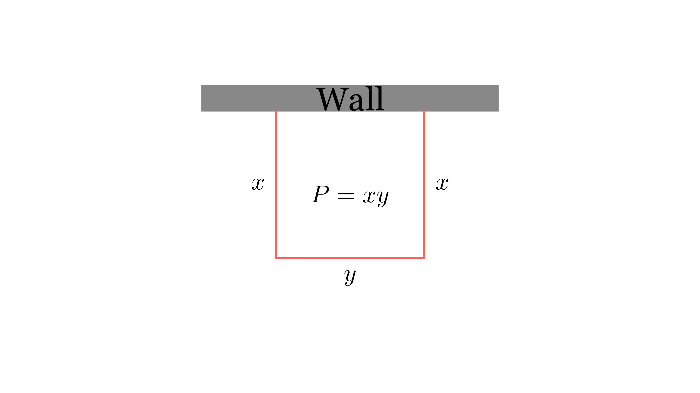

[⬅️ Назад кон Индексот](../README.md) | [🧰 Skill: extremal_principle](../../skill_guides/extremal_principle.md)

# Оптимизација на плоштина (Жица)

## 📝 Текст на задачата
Со 32 m жица сакате да заградите три страни на правоаголна површина (четвртата страна е ѕид). Која е најголемата можна плоштина која може да се загради?

## 📐 Скица

{ width=500 }

## 🧠 Анализа
**Зошто е оваа задача тешка?**
Нека страните нормални на ѕидот се $x$, а паралелната е $y$. Должината на жицата е $2x+y=32$. Плоштината е $P=xy$. Изрази го $y$ преку $x$ и најди го максимумот на квадратната функција.

**Конструктивен потег:**
Нека страните нормални на ѕидот се $x$, а паралелната е $y$. Должината на жицата е $2x+y=32$. Плоштината е $P=xy$. Изрази го $y$ преку $x$ и најди го максимумот на квадратната функција.

## 💡 Решение

??? success "👀 Прикажи го решението"
    Нека димензиите се $x$ (ширина) и $y$ (должина).
    Жицата оградува 3 страни: две ширини и една должина.
    $$ 2x + y = 32 \implies y = 32 - 2x $$
    
    Плоштината е:
    $$ P(x) = x \cdot y = x(32 - 2x) = -2x^2 + 32x $$
    
    Ова е парабола свртена надолу ($a=-2$). Максимумот се постигнува во темето:
    $$ x_T = -\frac{b}{2a} = -\frac{32}{2(-2)} = \frac{32}{4} = 8 $$
    
    Максималната плоштина е:
    $$ P(8) = -2(8)^2 + 32(8) = -128 + 256 = 128 \text{ m}^2 $$
    (Или $y = 32 - 16 = 16$, па $P = 8 \cdot 16 = 128$).
    
    **Одговор:** 128.

## 🏁 Заклучок
Видете го решението погоре.

## 👩‍🏫 За наставници
Класичен проблем на оптимизација. Кај правоаголник со една фиксна страна, максимумот е кога страните се однесуваат како 1:2 ($x=8, y=16$).