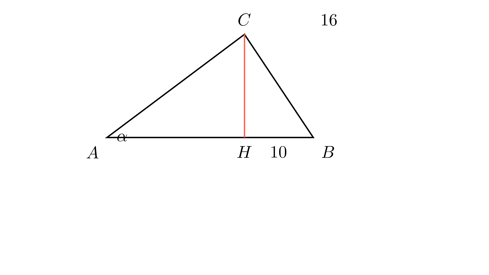

[⬅️ Назад кон Индексот](../../README.md) | [🧰 Skill: trigonometry](../../../tools/skill_guides/trigonometry.md)

# Котангенс во правоаголен триаголник

## 📝 Текст на задачата
Даден е правоаголен $\triangle ABC$ ($\angle C = 90^\circ$). Висината $CH$ ја дели хипотенузата на отсечки, при што $BH=10$. Дадено е и $BC=16$. Ако $\angle A = \alpha$, колку изнесува $\cot \alpha$?

## 📐 Скица

  

> Одете во `assets/manim_code_log.md`, копирајте го кодот за `Task_2022_mun_y3_5b` и генерирајте ја сликата.

## 🧠 Анализа
**Зошто е оваа задача тешка?**
Во правоаголен триаголник, $\cot A = \tan B$. Најди ги тригонометриските функции на аголот $B$ од триаголникот $BCH$ (кој е правоаголен).

**Конструктивен потег:**
Во правоаголен триаголник, $\cot A = \tan B$. Најди ги тригонометриските функции на аголот $B$ од триаголникот $BCH$ (кој е правоаголен).

## 💡 Решение

## 💡 Решение

??? success "👀 Прикажи го решението"
    Во $\triangle ABC$, $\angle C = 90^\circ$. $CH \perp AB$.
    Дадено: $BH=10, BC=16$.
    
    1. **Анализа на $\triangle BCH$:**
       Ова е правоаголен триаголник (прав агол кај $H$).
       Хипотенуза $BC=16$, катета $BH=10$.
       Другата катета $CH = \sqrt{16^2 - 10^2} = \sqrt{256 - 100} = \sqrt{156} = 2\sqrt{39}$.
    
    2. **Врска меѓу аглите:**
       Во правоаголен $\triangle ABC$: $\alpha + \beta = 90^\circ$.
       Значи $\cot \alpha = \cot(90^\circ - \beta) = \tan \beta$.
    
    3. **Пресметка:**
       Од $\triangle BCH$:
       $$ \tan \beta = \frac{CH}{BH} = \frac{2\sqrt{39}}{10} = \frac{\sqrt{39}}{5} $$
    
    **Одговор:** $\frac{\sqrt{39}}{5}$.

## 🏁 Заклучок
Видете го решението погоре.

## 👩‍🏫 За наставници
Користењето на комплементарни агли ($\cot A = \tan B$) е многу побрзо од пресметување на целата страна $AC$.