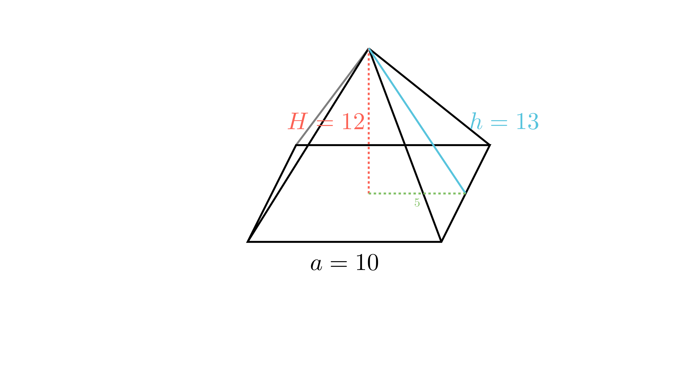

[⬅️ Назад кон Индексот](../README.md) | [🧰 Skill: visual_reasoning](../../skill_guides/visual_reasoning.md)

# Плоштина на пирамида

## 📝 Текст на задачата
Основниот раб и висината на една правилна четириаголна пирамида се однесуваат како $5:6$, а волуменот на пирамидата изнесува $400 \text{ cm}^3$. Пресметај ја плоштината на пирамидата.

## 📐 Скица

{ width=500 }
## 🧠 Анализа
**Зошто е оваа задача тешка?**
Имаме сооднос $a:H = 5:6$, што значи можеме да воведеме параметар $k$ ($a=5k, H=6k$) или да изразиме една преку друга. Искористете ја формулата за волумен за да ги најдете димензиите. За плоштината, ќе ви треба бочната висина $h$, која се наоѓа преку Питагорова теорема во карактеристичниот триаголник ($H, a/2, h$).

**Конструктивен потег:**
Имаме сооднос $a:H = 5:6$, што значи можеме да воведеме параметар $k$ ($a=5k, H=6k$) или да изразиме една преку друга. Искористете ја формулата за волумен за да ги најдете димензиите. За плоштината, ќе ви треба бочната висина $h$, која се наоѓа преку Питагорова теорема во карактеристичниот триаголник ($H, a/2, h$).

## 💡 Решение

??? tip "Чекор 1: Наоѓање на димензиите"
    Дадено е $a:H = 5:6 \implies H = \frac{6}{5}a$.
    Волуменот е $V = \frac{1}{3}a^2 H = 400$.
    Заменуваме:
    $$ \frac{1}{3}a^2 \left(\frac{6}{5}a\right) = 400 $$
    $$ \frac{2}{5}a^3 = 400 $$
    $$ a^3 = 400 \cdot \frac{5}{2} = 1000 $$
    $$ a = 10 \text{ cm} $$
    Тогаш $H = \frac{6}{5}(10) = 12 \text{ cm}$.

??? tip "Чекор 2: Бочна висина ($h$)"
    Во правоаголниот триаголник формиран од висината на пирамидата, апотемата на основата ($a/2$) и бочната висина ($h$):
    $$ h^2 = H^2 + (a/2)^2 $$
    $$ h^2 = 12^2 + 5^2 = 144 + 25 = 169 $$
    $$ h = 13 \text{ cm} $$

??? tip "Чекор 3: Плоштина"
    Плоштината е збир на основата и обвивката ($M = 4 \cdot \frac{ah}{2} = 2ah$).
    $$ P = B + M = a^2 + 2ah $$
    $$ P = 10^2 + 2(10)(13) = 100 + 260 = 360 \text{ cm}^2 $$

## 🏁 Заклучок
Видете го решението погоре.

## 👩‍🏫 За наставници
Скицата е задолжителна. Учениците често мешаат бочен раб ($s$) со бочна висина ($h$). Тука ни треба $h$ за плоштината.