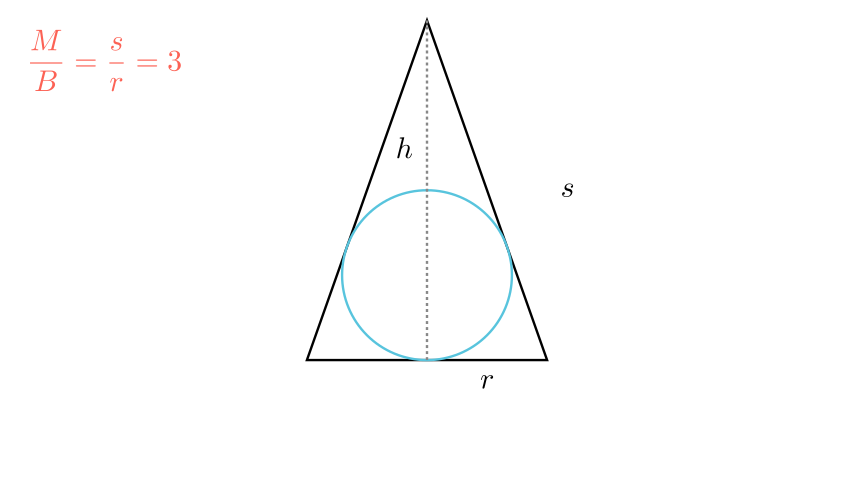

[⬅️ Назад кон Индексот](../README.md) | [🧰 Skill: logic](../../skill_guides/logic.md)

# Конус и впишана топка

## 📝 Текст на задачата
Даден е конус чија обвивка има плоштина $M$ и основа $B$. Ако волуменот на конусот е два пати поголем од волуменот на топката впишана во него, одреди го количникот $M/B$.

## 📐 Скица

{ width=500 }

## 🧠 Анализа
**Зошто е оваа задача тешка?**
Работете со осниот пресек. Тоа е рамнокрак триаголник со впишана кружница. Изразете ги $M$ и $B$ преку радиусот $r$ и изводницата $s$. Односот $M/B = \pi r s / \pi r^2 = s/r$. Искористете го условот за волумените за да најдете врска меѓу $s$ и $r$.

**Конструктивен потег:**
Работете со осниот пресек. Тоа е рамнокрак триаголник со впишана кружница. Изразете ги $M$ и $B$ преку радиусот $r$ и изводницата $s$. Односот $M/B = \pi r s / \pi r^2 = s/r$. Искористете го условот за волумените за да најдете врска меѓу $s$ и $r$.

## 💡 Решение

??? tip "Чекор 1: Геометриски врски"
    Од сличност на триаголници во осниот пресек (види скица), важи:
    
    $$ \frac{R}{r} = \frac{h-R}{s} \implies Rs = rh - rR \implies R(s+r) = rh \implies R = \frac{rh}{s+r} $$

??? tip "Чекор 2: Услов за волумени"
    Дадено е $V_{konus} = 2 V_{topка}$.
    
    $$ \frac{1}{3}\pi r^2 h = 2 \cdot \frac{4}{3}\pi R^3 $$
    
    $$ r^2 h = 8 R^3 $$

??? tip "Чекор 3: Замена и упростување"
    Заменуваме за $R$:
    
    $$ r^2 h = 8 \left( \frac{rh}{s+r} \right)^3 $$
    
    $$ r^2 h = 8 \frac{r^3 h^3}{(s+r)^3} $$
    
    Делиме со $r^2 h$ (ненулти):
    
    $$ 1 = 8 \frac{r h^2}{(s+r)^3} \implies (s+r)^3 = 8 r h^2 $$
    
    Користиме $h^2 = s^2 - r^2 = (s-r)(s+r)$:
    
    $$ (s+r)^3 = 8 r (s-r)(s+r) $$
    
    Делиме со $(s+r)$:
    
    $$ (s+r)^2 = 8r(s-r) $$
    
    $$ s^2 + 2sr + r^2 = 8rs - 8r^2 $$
    
    $$ s^2 - 6sr + 9r^2 = 0 $$
    
    $$ (s - 3r)^2 = 0 \implies s = 3r $$

??? tip "Чекор 4: Конечен количник"
    Бараме $M/B = \frac{\pi r s}{\pi r^2} = \frac{s}{r}$.
    Бидејќи $s = 3r$, количникот е 3.

## 🏁 Заклучок
Видете го решението погоре.

## 👩‍🏫 За наставници
Клучот е да се изрази $R$ преку елементите на конусот. Формулата $R = rac{rh}{s+r}$ е многу корисна и вреди да се запамети (радиус на впишана кружница во рамнокрак триаголник).