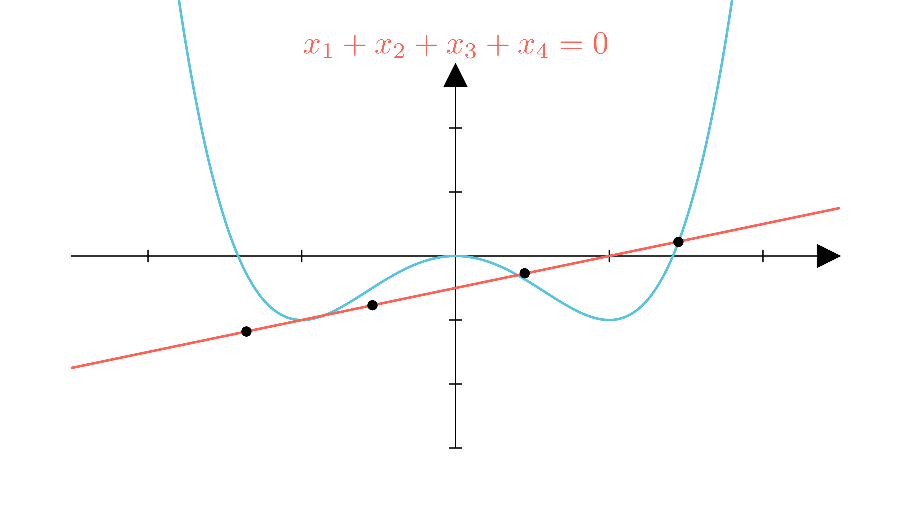

[⬅️ Назад кон Индексот](../README.md) | [🧰 Skill: vieta_formulas](../../skill_guides/vieta_formulas.md)

# Пресек на крива и права

## 📝 Текст на задачата
На кривата $y = x^4 - 2x^2$ се наоѓаат 4 различни точки кои лежат на една права. Докажи дека збирот на апсцисните координати ($x$-координатите) на овие четири точки е 0.

## 📐 Скица

  

## 🧠 Анализа
**Зошто е оваа задача тешка?**
Пресекот на кривата $y = f(x)$ и правата $y = kx + n$ се наоѓа со решавање на системот. Ова води до равенка од 4-ти степен: $x^4 - 2x^2 - kx - n = 0$. Користете ги Виетовите формули за збирот на корените.

**Конструктивен потег:**
Пресекот на кривата $y = f(x)$ и правата $y = kx + n$ се наоѓа со решавање на системот. Ова води до равенка од 4-ти степен: $x^4 - 2x^2 - kx - n = 0$. Користете ги Виетовите формули за збирот на корените.

## 💡 Решение

??? tip "Чекор 1: Равенка на правата"
    Нека правата е $y = kx + n$.

??? tip "Чекор 2: Равенка на пресекот"
    Изедначуваме:
    $$ x^4 - 2x^2 = kx + n $$
    $$ x^4 - 2x^2 - kx - n = 0 $$

??? tip "Чекор 3: Виетови формули"
    Ова е полином од 4-ти степен: $1 \cdot x^4 + 0 \cdot x^3 - 2 \cdot x^2 - k \cdot x - n = 0$.
    Збирот на корените $x_1, x_2, x_3, x_4$ е даден со формула:
    $$ S = -\frac{\text{коефициент пред } x^3}{\text{коефициент пред } x^4} $$

??? tip "Чекор 4: Заклучок"
    Бидејќи коефициентот пред $x^3$ е 0, следи:
    $$ x_1 + x_2 + x_3 + x_4 = -\frac{0}{1} = 0 $$
    
    Што и требаше да се докаже.

## 🏁 Заклучок
Видете го решението погоре.

## 👩‍🏫 За наставници
Ова важи за секој полином каде што недостасува членот $x^{n-1}$. Графички, ова сугерира одредена симетрија на корените околу нулата (нивниот 'центар на маса' е во 0 по x-оската).