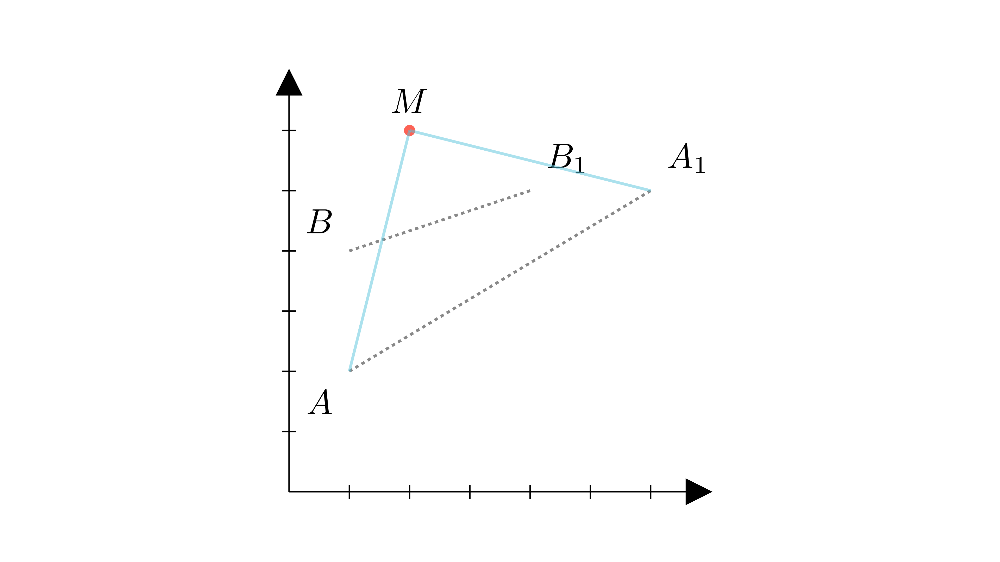

# Ротација и координати

<!-- Ова место е резервирано за автоматската слика од Manim -->

  

## 📝 Текст на задачата
При ротација со центар во точката $M$ и агол $\alpha$, точката $A(1,2)$ се пресликува во $A_1(6,5)$, а точката $B(1,4)$ во $B_1(4,5)$. Пресметај го збирот на координатите на точката $M$.

---

## 🧠 Анализа (Геометриска Интуиција)
<!-- Овој текст ќе биде скриен зад копче "💡 Прикажи помош" -->

💡 Прикажи помош (Анализа)

Центарот на ротација $M$ е еднакво оддалечен од $A$ и $A_1$ ($MA=MA_1$), и од $B$ и $B_1$ ($MB=MB_1$). Значи $M$ лежи на симетралата на $AA_1$ и на симетралата на $BB_1$. Најди го пресекот на овие две прави.

---

## 📐 Решение
<!-- Овој текст ќе биде скриен зад копче "📝 Прикажи решение" -->
<Детално решение, чекор по чекор. Користи "Синтетичка геометрија" (агли, складност) освен ако не е наведено поинаку.>

**Краен одговор:** 

---

## 👨‍🏫 Педагошки белешки
Центарот на ротација е секогаш пресек на симетралите на отсечките што ги поврзуваат оригиналните и слика-точките.

---

### 🔗 Поврзани вештини
*   **Примарна вештина:** [transformation_geometry](../../skill_guides/transformation_geometry.md)
*   **Потребни предзнаења:**
  - coordinate_geometry
  - perpendicular_bisector