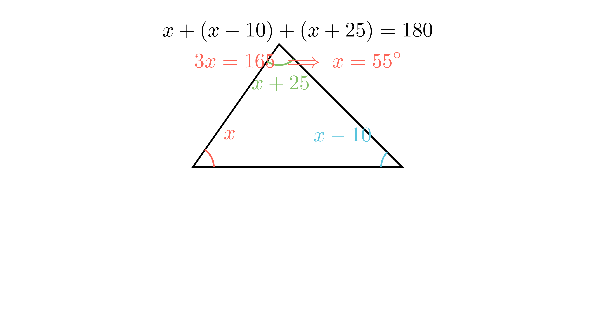

[⬅️ Назад кон Индексот](../README.md) | [🧰 Skill: working_backwards](../../skill_guides/working_backwards.md)

# Низа со делење

## 📝 Текст на задачата
Во низата од четири природни броеви $\_, \_, 51, \_$, од кои само бројот 51 е запишан, секој следен член е три пати помал од претходниот. Колку изнесува збирот од броевите што не се запишани во низата?

## 📐 Скица

  

## 🧠 Анализа (Клучна идеја)
Низата е $x_1, x_2, x_3, x_4$. Знаеме $x_3 = 51$. Правилото е $x_{n+1} = x_n / 3$. Ова значи $x_n = 3 \cdot x_{n+1}$ (ако одиме наназад).

## 💡 Решение

??? tip "Чекор 1: Наоѓање на $x_4$"
    $x_4$ е следен по 51.
    $$ x_4 = 51 : 3 = 17 $$

??? tip "Чекор 2: Наоѓање на $x_2$ и $x_1$"
    Одиме наназад (множиме со 3).
    $$ x_2 = 51 \cdot 3 = 153 $$
    $$ x_1 = 153 \cdot 3 = 459 $$

??? tip "Чекор 3: Збир на незапишаните"
    Незапишани се $x_1, x_2, x_4$.
    $$ S = 459 + 153 + 17 = 629 $$
    
    Одговор: 629.

## 🏁 Заклучок
Видете го решението погоре.

## 👩‍🏫 За наставници
Внимавајте на насоката. „Следниот е помал“ значи дека претходниот е поголем.