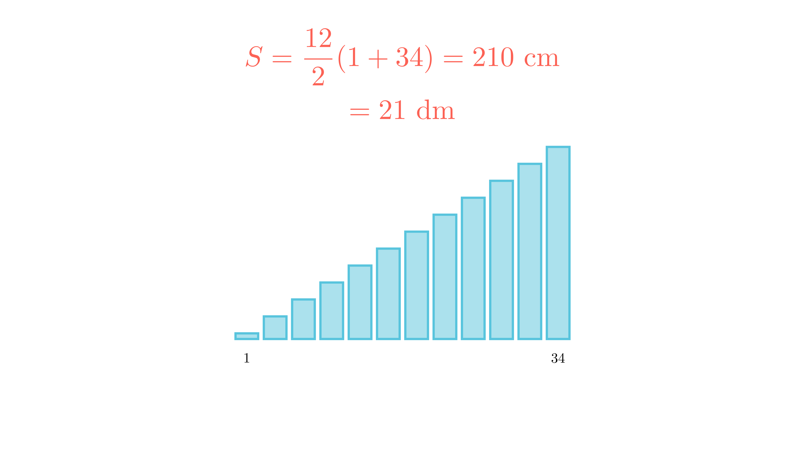

[⬅️ Назад кон Индексот](../../README.md) | [🧰 Skill: pattern_recognition](../../../tools/skill_guides/pattern_recognition.md)

# Искршена линија

## 📝 Текст на задачата
Една искршена линија е образувана од 12 отсечки. Почетната има должина 1 cm, а секоја следна е за 3 cm поголема од претходната. Колку dm изнесува вкупната должина?

## 📐 Скица
<!-- Ова место е резервирано за автоматската слика од Manim -->

  

  

## 🧠 Анализа
**Зошто е оваа задача тешка?**
Ова е збир на аритметичка прогресија: $1, 4, 7, \dots$. Има 12 членови. Користете го Гаусовиот метод (збир на првиот и последниот помножен со бројот на парови) или едноставно собирање.

**Конструктивен потег:**
Ова е збир на аритметичка прогресија: $1, 4, 7, \dots$. Има 12 членови. Користете го Гаусовиот метод (збир на првиот и последниот помножен со бројот на парови) или едноставно собирање.

## 💡 Решение

## 💡 Решение

??? tip "Чекор 1: Одредување на членовите"
    Низата е: $1, 4, 7, \dots$
    Последниот (12-ти) член е: $a_{12} = 1 + (12-1) \cdot 3 = 1 + 33 = 34$ cm.

??? tip "Чекор 2: Пресметка на збирот"
    Формула: $S = \frac{n}{2}(a_1 + a_n)$.
    $$ S = \frac{12}{2}(1 + 34) = 6 \cdot 35 $$
    $$ S = 210 \text{ cm} $$

??? tip "Чекор 3: Претворање во dm"
    $210 \text{ cm} = 21 \text{ dm}$.

## 🏁 Заклучок
Видете го решението погоре.

## 👩‍🏫 За наставници
Внимавајте на мерните единици на крајот. Резултатот се бара во дециметри.