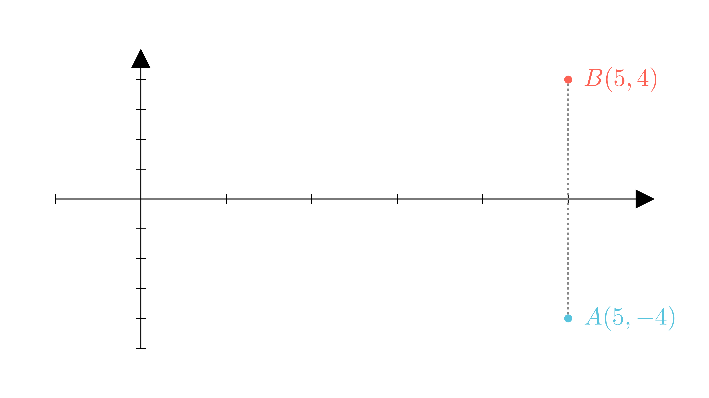

[⬅️ Назад кон Индексот](../README.md) | [🧰 Skill: coordinate_geometry](../../skill_guides/coordinate_geometry.md)

# Координати и симетрија

## 📝 Текст на задачата
Дадена е точката $A(5, -4)$. Нека $B$ е симетрична на $A$ во однос на $x$-оската. Удвоениот производ од координатите на точката $B$ е...

## 📐 Скица

  

## 🧠 Анализа
**Зошто е оваа задача тешка?**
При осна симетрија во однос на $x$-оската, $x$-координатата останува иста, а $y$-координатата го менува знакот ($y 	o -y$).

**Конструктивен потег:**
При осна симетрија во однос на $x$-оската, $x$-координатата останува иста, а $y$-координатата го менува знакот ($y 	o -y$).

## 💡 Решение

??? tip "Чекор 1: Наоѓање на точката B"
    Точката $A$ има координати $(5, -4)$.
    Симетрична точка во однос на $x$-оската е $B(x, -y)$.
    Значи $B(5, -(-4)) = B(5, 4)$.

??? tip "Чекор 2: Пресметка"
    Бараме удвоен производ на координатите на $B$:
    $$ P = 2 \cdot x_B \cdot y_B $$
    $$ P = 2 \cdot 5 \cdot 4 = 40 $$
    
    Одговор: 40.

## 🏁 Заклучок
Видете го решението погоре.

## 👩‍🏫 За наставници
Визуелизацијата е клучна: Точката A е долу десно (IV квадрант), B оди горе десно (I квадрант).