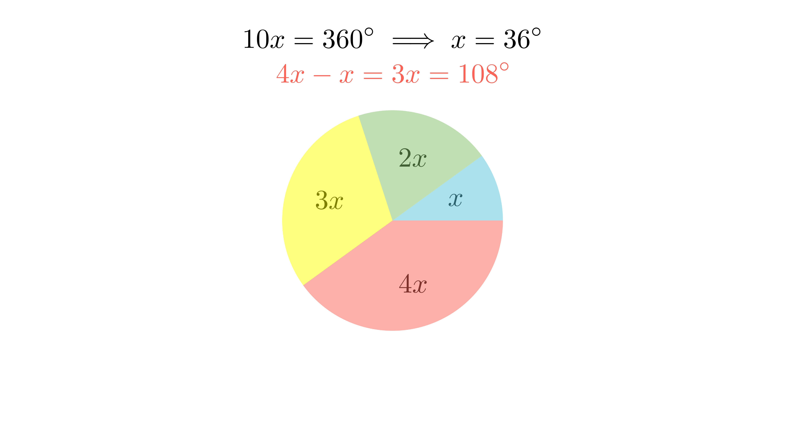

[⬅️ Назад кон Индексот](../README.md) | [🧰 Skill: proportions](../../skill_guides/proportions.md)

# Размер на агли

## 📝 Текст на задачата
Внатрешните агли во четириаголникот се однесуваат како $1:2:3:4$. Одреди ја разликата меѓу најголемиот и најмалиот агол.

## 📐 Скица

  

  

## 🧠 Анализа
**Зошто е оваа задача тешка?**
Збирот на аглите во четириаголник е $360^\circ$. Нека аглите се $x, 2x, 3x, 4x$. Поставете равенка за нивниот збир.

**Конструктивен потег:**
Збирот на аглите во четириаголник е $360^\circ$. Нека аглите се $x, 2x, 3x, 4x$. Поставете равенка за нивниот збир.

## 💡 Решение

??? tip "Чекор 1: Поставување равенка"
    $$ x + 2x + 3x + 4x = 360^\circ $$
    $$ 10x = 360^\circ $$
    $$ x = 36^\circ $$

??? tip "Чекор 2: Наоѓање на аглите"
    Најмал агол: $x = 36^\circ$.
    Најголем агол: $4x = 4 \cdot 36^\circ = 144^\circ$.

??? tip "Чекор 3: Разлика"
    $$ \Delta = 144^\circ - 36^\circ = 108^\circ $$
    
    Одговор: 108.

## 🏁 Заклучок
Видете го решението погоре.

## 👩‍🏫 За наставници
Пропорциите секогаш се решаваат со воведување на коефициент $k$ (или $x$).