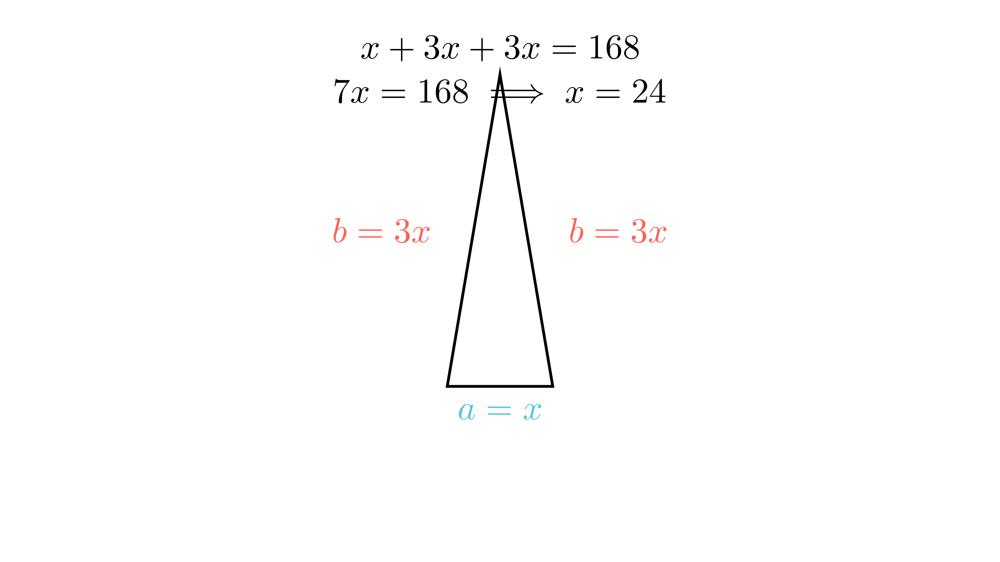

[⬅️ Назад кон Индексот](../README.md) | [🧰 Skill: algebraic_manipulation](../../skill_guides/algebraic_manipulation.md)

# Периметар на рамнокрак триаголник

## 📝 Текст на задачата
Определи ги должините на страните на рамнокрак триаголник со периметар 168 cm ако должината на основата е три пати помала од должината на кракот.

## 📐 Скица

  

## 🧠 Анализа
**Зошто е оваа задача тешка?**
Означете ја најмалата страна со $x$. Тука основата е помала, па нека основата е $a=x$. Тогаш кракот е $b=3x$. Периметарот е збир на сите страни ($a+2b$).

**Конструктивен потег:**
Означете ја најмалата страна со $x$. Тука основата е помала, па нека основата е $a=x$. Тогаш кракот е $b=3x$. Периметарот е збир на сите страни ($a+2b$).

## 💡 Решение

??? tip "Чекор 1: Означување"
    Нека должината на основата е $a = x$.
    Бидејќи основата е 3 пати помала од кракот, тогаш кракот е $b = 3x$.

??? tip "Чекор 2: Поставување на равенката"
    Периметарот е $L = a + 2b = 168$.
    Заменуваме:
    $$ x + 2(3x) = 168 $$
    $$ x + 6x = 168 $$
    $$ 7x = 168 $$

??? tip "Чекор 3: Решавање"
    $$ x = 168 : 7 = 24 $$

??? tip "Чекор 4: Пресметка на страните"
    *   Основа $a = 24$ cm.
    *   Крак $b = 3 \cdot 24 = 72$ cm.
    
    **Проверка:** $24 + 72 + 72 = 168$. Точно.

## 🏁 Заклучок
Видете го решението погоре.

## 👩‍🏫 За наставници
Внимавајте на формулацијата „три пати помала“. Тоа значи $a = b/3$ или $b = 3a$. Втората варијанта е полесна за работа (без дропки).