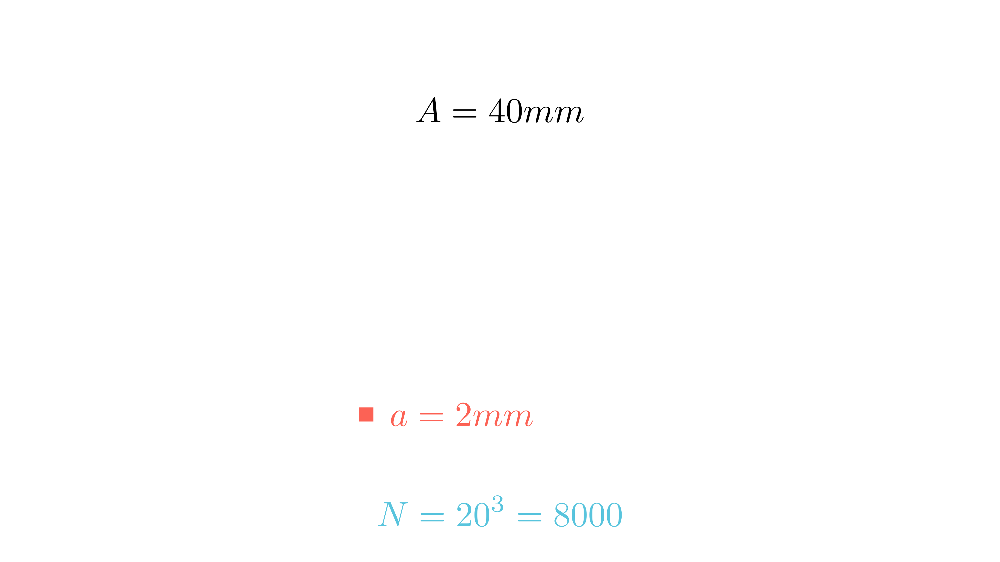

[⬅️ Назад кон Индексот](../README.md) | [🧰 Skill: visual_reasoning](../../skill_guides/visual_reasoning.md)

# Коцки во коцка

## 📝 Текст на задачата
Колку најмногу коцки со волумен $8 \text{ mm}^3$ можат да се сместат во внатрешноста на коцка со раб $4 \text{ cm}$?

## 📐 Скица

  

## 🧠 Анализа
**Зошто е оваа задача тешка?**
Прво најдете ја страната на малата коцка ($a=\sqrt[3]{8}$). Потоа претворете го работ на големата коцка во истата мерна единица (mm).

**Конструктивен потег:**
Прво најдете ја страната на малата коцка ($a=\sqrt[3]{8}$). Потоа претворете го работ на големата коцка во истата мерна единица (mm).

## 💡 Решение

??? tip "Чекор 1: Страна на малата коцка"
    $V = a^3 = 8 \implies a = 2 \text{ mm}$.

??? tip "Чекор 2: Страна на големата коцка"
    $A = 4 \text{ cm} = 40 \text{ mm}$.

??? tip "Чекор 3: Број на коцки"
    По должина, ширина и висина собира:
    $$ n = \frac{40}{2} = 20 \text{ коцки} $$
    Вкупно: $N = 20^3 = 8000$.

## 🏁 Заклучок
Видете го решението погоре.

## 👩‍🏫 За наставници
Важно е да се провери дали малите коцки „совршено“ ја пополнуваат големата (дали 40 е деливо со 2). Во овој случај да.