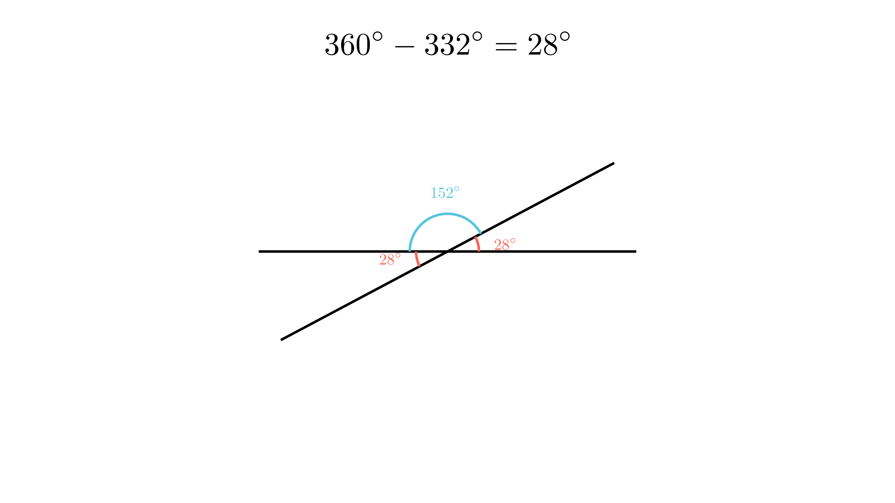

[⬅️ Назад кон Индексот](../../README.md) | [🧰 Skill: angle_chasing](../../../tools/skill_guides/angle_chasing.md)

# Агли при пресек на прави

## 📝 Текст на задачата
Збирот на три од четирите агли кои се формираат при пресекот на две дадени прави е еднаков на $332^\circ$. Определи ја големината на секој од тие четири агли.

## 📐 Скица

  

## 🧠 Анализа
**Зошто е оваа задача тешка?**
При пресек на две прави се формираат 4 агли. Нивниот збир е полн агол ($360^\circ$). Ако збирот на три од нив е 332, лесно можеме да го најдеме четвртиот агол.

**Конструктивен потег:**
При пресек на две прави се формираат 4 агли. Нивниот збир е полн агол ($360^\circ$). Ако збирот на три од нив е 332, лесно можеме да го најдеме четвртиот агол.

## 💡 Решение

??? tip "Чекор 1: Наоѓање на четвртиот агол"
    Збирот на сите 4 агли е $360^\circ$.
    Нека непознатиот (четвртиот) агол е $x$.
    $$ 332^\circ + x = 360^\circ $$
    $$ x = 360^\circ - 332^\circ = 28^\circ $$

??? tip "Чекор 2: Наоѓање на останатите агли"
    При пресек на две прави, аглите се појавуваат во парови на накрстни (еднакви) агли.
    Значи, еден од другите агли мора да биде накрстен на $x$, па и тој е $28^\circ$.
    Останатите два агли се суплементни на $x$ (заедно прават $180^\circ$).
    $$ y = 180^\circ - 28^\circ = 152^\circ $$
    
    **Одговор:** Аглите се $28^\circ, 152^\circ, 28^\circ, 152^\circ$.

## 🏁 Заклучок
Видете го решението погоре.

## 👩‍🏫 За наставници
Ова е многу поедноставен начин отколку да се поставуваат равенки со $\alpha$ и $\beta$. Својството на полн агол е клучно.