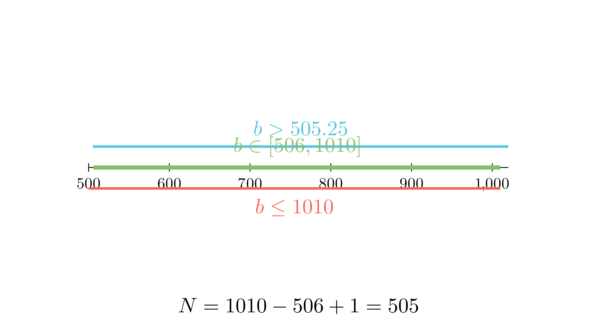

[⬅️ Назад кон Индексот](../../README.md) | [🧰 Skill: inequalities](../../../tools/skill_guides/inequalities.md)

# Рамнокраки триаголници со целобројни страни

## 📝 Текст на задачата
Ги разгледуваме рамнокраките триаголници чии должини на страни во сантиметри се природни броеви. Одреди го бројот на сите такви триаголници чиј периметар изнесува 2021 cm.

## 📐 Скица

  

> Одете во `assets/manim_code_log.md`, копирајте го кодот за `Task_2024_mun_g7_4` и генерирајте ја сликата.

## 🧠 Анализа
**Зошто е оваа задача тешка?**
Нека страните се $a, b, b$ (основа $a$, крак $b$). Периметарот е $a + 2b = 2021$. Од неравенството на триаголник, мора $a < b + b$, т.е. $a < 2b$. Заменете го $a$ од периметарот во неравенството за да најдете граници за $b$.

**Конструктивен потег:**
Нека страните се $a, b, b$ (основа $a$, крак $b$). Периметарот е $a + 2b = 2021$. Од неравенството на триаголник, мора $a < b + b$, т.е. $a < 2b$. Заменете го $a$ од периметарот во неравенството за да најдете граници за $b$.

## 💡 Решение

## 💡 Решение

??? tip "Чекор 1: Поставување на условите"
    Периметар: $a + 2b = 2021 \implies a = 2021 - 2b$.
    Бидејќи $a$ е природен број, $a \ge 1$.
    Неравенство на триаголник: $a < 2b$.

??? tip "Чекор 2: Граници за $b$"
    Заменуваме $a$ во неравенството:
    $$ 2021 - 2b < 2b $$
    $$ 2021 < 4b $$
    $$ b > \frac{2021}{4} = 505.25 $$
    Значи, најмалото $b$ е **506**.
    
    Од условот $a \ge 1$:
    $$ 2021 - 2b \ge 1 $$
    $$ 2020 \ge 2b $$
    $$ b \le 1010 $$
    Значи, најголемото $b$ е **1010**.

??? tip "Чекор 3: Броење на решенија"
    Бројот на можни вредности за $b$ е бројот на цели броеви во интервалот $[506, 1010]$.
    $$ N = 1010 - 506 + 1 = 505 $$
    
    За секое такво $b$, $a$ е еднозначно определено ($a = 2021 - 2b$).
    Одговор: 505 триаголници.

## 🏁 Заклучок
Видете го решението погоре.

## 👩‍🏫 За наставници
Ова е стандарден алгоритам за броење триаголници со фиксен периметар. За непарен периметар $P$, бројот на рамнокраки триаголници е најблискиот цел број до $P^2/48$? Не, тоа е за разнострани. За рамнокраки формулата е поедноставна, но изведувањето преку неравенства е најсигурно.