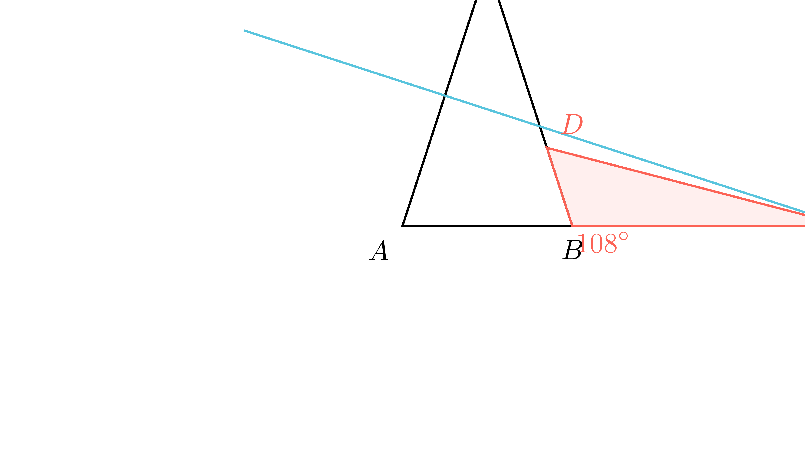

[⬅️ Назад кон Индексот](../../README.md) | [🧰 Skill: logic](../../../tools/skill_guides/logic.md)

# Симетрала на крак

## 📝 Текст на задачата
Во рамнокракиот триаголник $ABC$ аголот при врвот $C$ е двапати помал од аголот при основата. Симетралата на кракот $AC$ го сече другиот крак во точката $D$, а правата $AB$ ја сече во точката $E$. Определи ги внатрешните агли на $\triangle BED$.

## 📐 Скица

  

## 🧠 Анализа
**Зошто е оваа задача тешка?**
Прво пресметајте ги аглите на $\triangle ABC$. Условот $\alpha = 2\gamma$ и $2\alpha + \gamma = 180^\circ$ дава $\alpha=72^\circ, \gamma=36^\circ$. Клучно е да се нацрта прецизна скица: бидејќи аголот при основата е остар ($72^\circ$), симетралата на кракот ќе ја сече *продолжението* на основата $AB$ (надвор од триаголникот).

**Конструктивен потег:**
Прво пресметајте ги аглите на $\triangle ABC$. Условот $\alpha = 2\gamma$ и $2\alpha + \gamma = 180^\circ$ дава $\alpha=72^\circ, \gamma=36^\circ$. Клучно е да се нацрта прецизна скица: бидејќи аголот при основата е остар ($72^\circ$), симетралата на кракот ќе ја сече *продолжението* на основата $AB$ (надвор од триаголникот).

## 💡 Решение

??? tip "Чекор 1: Агли во $\triangle ABC$"
    Нека $\gamma$ е аголот при врвот $C$, а $\alpha$ при основата. Дадено е $\alpha = 2\gamma$.
    Збирот на аглите е $180^\circ$:
    $$ 2\alpha + \gamma = 180^\circ \implies 2(2\gamma) + \gamma = 180^\circ \implies 5\gamma = 180^\circ $$
    $$ \gamma = 36^\circ, \quad \alpha = 72^\circ $$

??? tip "Чекор 2: Аголот кај $E$"
    Нека $s$ е симетралата на $AC$, и $M$ е средината на $AC$. Триаголникот $AME$ е правоаголен (бидејќи $s \perp AC$).
    Во $\triangle AME$: $\angle A = 72^\circ, \angle M = 90^\circ$.
    $$ \angle AEM = 90^\circ - 72^\circ = 18^\circ $$
    Значи, еден агол во бараниот триаголник е $\angle E = 18^\circ$.

??? tip "Чекор 3: Положбата на $E$ и аголот кај $B$"
    Бидејќи $AE > AB$ (ова може да се докаже тригонометриски или со цртање), точката $B$ се наоѓа помеѓу $A$ и $E$. 
    Затоа, аголот $\angle EBD$ е надворешен агол на $\triangle ABC$ кај темето $B$, или поточно суплементарен на $\angle ABC = 72^\circ$.
    $$ \angle EBD = 180^\circ - 72^\circ = 108^\circ $$

??? tip "Чекор 4: Аголот кај $D$"
    Во $\triangle BED$, збирот на аглите е $180^\circ$.
    $$ \angle BDE = 180^\circ - (108^\circ + 18^\circ) = 180^\circ - 126^\circ = 54^\circ $$
    
    **Одговор:** Аглите се $18^\circ, 108^\circ, 54^\circ$.

## 🏁 Заклучок
Видете го решението погоре.

## 👩‍🏫 За наставници
Оваа задача е позната како „Златен триаголник“ ($72-72-36$). Многу е важно учениците да разберат зошто $E$ е надвор од $AB$. Ако $E$ беше внатре, аголот $B$ ќе беше $72^\circ$, што би дало $\angle D = 90^\circ$, но тогаш $D$ не би можело да биде на $BC$.