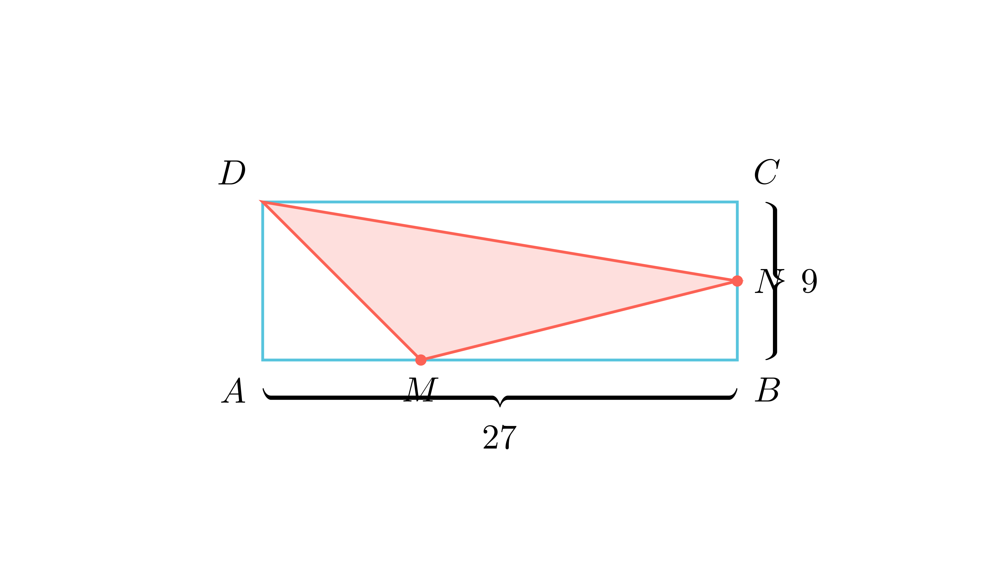

# Плоштина на впишан триаголник

## Текст на задачата
Точката $M$ ја дели страната $AB$ на правоаголникот $ABCD$ во однос $1:2$, а точката $N$ ја дели страната $BC$ на два еднакви дела. Периметарот на правоаголникот е 72 cm, и при тоа страната $BC$ е три пати помала од страната $AB$. Пресметај ја плоштината на $\triangle DMN$.

## 📐 Скица / Конструкција
{ width=500 }

## 🧠 Анализа
Не се обидувај директно да ја пресметаш плоштината на $\triangle DMN$ (немаме формула за косоаголен триаголник). Наместо тоа, пресметај ја плоштината на целиот правоаголник и одземи ги плоштините на трите правоаголни триаголници во ќошевите ($ADM, MBN, NCD$).

## 📝 Решение (СИНТЕТИЧКО)
### Чекор 1: Димензии на правоаголникот
Нека $BC = x$. Тогаш $AB = 3x$.
Периметарот е $L = 2(AB + BC) = 2(3x + x) = 8x$.
Дадено е $L = 72$, па:
$$ 8x = 72 \implies x = 9 \text{ cm} $$
Значи страните се:
- $BC = AD = 9 \text{ cm}$
- $AB = CD = 27 \text{ cm}$

### Чекор 2: Позиции на точките
- $M$ ја дели $AB$ во однос $1:2$. Значи $AM = \frac{1}{3}AB = 9$, $MB = \frac{2}{3}AB = 18$.
- $N$ е средина на $BC$. Значи $BN = NC = 4,5$.

### Чекор 3: Плоштини на деловите
Вкупна плоштина на $ABCD$: $P = 27 \cdot 9 = 243 \text{ cm}^2$.

Плоштини на триаголниците во ќошевите:
1. $P_{ADM} = \frac{AD \cdot AM}{2} = \frac{9 \cdot 9}{2} = 40,5$
2. $P_{MBN} = \frac{MB \cdot BN}{2} = \frac{18 \cdot 4,5}{2} = 9 \cdot 4,5 = 40,5$
3. $P_{NCD} = \frac{NC \cdot CD}{2} = \frac{4,5 \cdot 27}{2} = \frac{121,5}{2} = 60,75$

### Чекор 4: Одземање
$$ P_{DMN} = P_{ABCD} - (P_{ADM} + P_{MBN} + P_{NCD}) $$
$$ P_{DMN} = 243 - (40,5 + 40,5 + 60,75) $$
$$ P_{DMN} = 243 - 141,75 $$
$$ P_{DMN} = 101,25 \text{ cm}^2 $$

**Резултат:** Плоштината е $\boxed{101,25 \text{ cm}^2}$.

## ⚠️ Аналитички пристап (само ако е неизбежен)
<Ако мора да се користат координати, објасни зошто синтетичкиот пат е претежок.>

## 🏁 Заклучок
Видете го решението погоре.