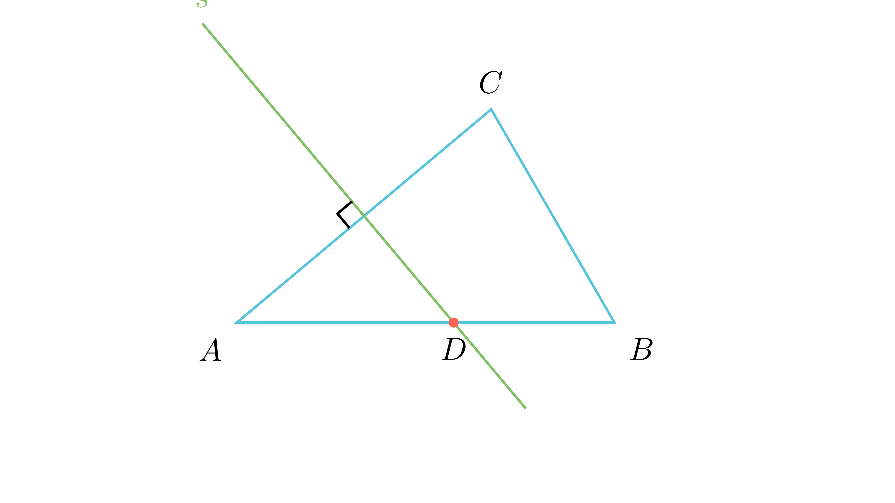

---
allowed_tools:
- classical_euclidean
- similarity
- symmetry
difficulty: 4
field: geometry
forbidden_tools:
- coordinate_geometry
- vectors
- complex_numbers
geometry_style: synthetic
grade: 7
language_original: <mk | en | sr | hr | ...>
primary_skill: <main_tool>
problem_id: 4411
related_skills:
- arithmetic_progression
- perpendicular_bisector
- right_triangle
related_theorems:
- geometry_construction
source: <натпревар / списание / година>
tags:
- geometry
- olympiad
translated: false
---

# Агли во триаголник и симетрала

## Текст на задачата
Во $\triangle ABC$ важи: $\angle CBA$ е за онолку степени поголем од $\angle BAC$ за колку што е $\angle ACB$ поголем од $\angle CBA$. Симетралата на страната $AC$ ја сече страната $AB$ под агол од $50^\circ$. Одреди ги големините на аглите во $\triangle ABC$.

## 📐 Скица / Конструкција
{ width=500 }

## 🧠 Анализа
Задачата има два независни услови. Првиот услов (за разликата на аглите) значи дека аглите формираат аритметичка прогресија - ова веднаш ти го открива средниот агол ($\beta$). Вториот услов бара да нацрташ правоаголен триаголник.

## 📝 Решение (СИНТЕТИЧКО)
Ги означуваме аглите со $\alpha, \beta, \gamma$.

### Чекор 1: Алгебарска врска (Аритметичка прогресија)
Условот вели дека разликата меѓу $\beta$ и $\alpha$ е иста како разликата меѓу $\gamma$ и $\beta$:
$$ \beta - \alpha = \gamma - \beta $$
Ова се прередува во:
$$ 2\beta = \alpha + \gamma $$

Знаеме дека збирот на агли во триаголник е $180^\circ$:
$$ \alpha + \beta + \gamma = 180^\circ $$
Заменуваме $(\alpha + \gamma)$ со $2\beta$:
$$ 2\beta + \beta = 180^\circ \implies 3\beta = 180^\circ \implies \boxed{\beta = 60^\circ} $$

### Чекор 2: Геометриска конструкција
Нека $s$ е симетралата на страната $AC$. Нека $M$ е пресекот на $s$ со $AC$ (средина).
Бидејќи е симетрала, важи $s \perp AC$, односно $\angle AMC = 90^\circ$.

Симетралата ја сече страната $AB$ во точка $D$. Според условот, аголот под кој се сечат е $50^\circ$. Тоа значи дека во $\triangle AMD$, аголот кај темето $D$ е $50^\circ$ (или неговиот суплементен, сеедно за пресметката на третиот агол).

### Чекор 3: Пресметка на $\alpha$
Го разгледуваме правоаголниот триаголник $\triangle AMD$:
- $\angle M = 90^\circ$
- $\angle D = 50^\circ$
- $\angle A = \alpha$

Збирот на аглите е $180^\circ$:
$$ \alpha + 90^\circ + 50^\circ = 180^\circ $$
$$ \alpha = 180^\circ - 140^\circ = 40^\circ $$
Значи, $\boxed{\alpha = 40^\circ}$.

### Чекор 4: Пресметка на $\gamma$
Сега ги имаме $\alpha$ и $\beta$, па лесно го наоѓаме $\gamma$:
$$ \gamma = 180^\circ - (60^\circ + 40^\circ) = 180^\circ - 100^\circ = 80^\circ $$
Значи, $\boxed{\gamma = 80^\circ}$.

**Проверка:** Аглите се $40^\circ, 60^\circ, 80^\circ$. Разликата е константна ($20^\circ$), што го задоволува првиот услов.

## ⚠️ Аналитички пристап (само ако е неизбежен)
<Ако мора да се користат координати, објасни зошто синтетичкиот пат е претежок.>

## 🏁 Заклучок
Видете го решението погоре.