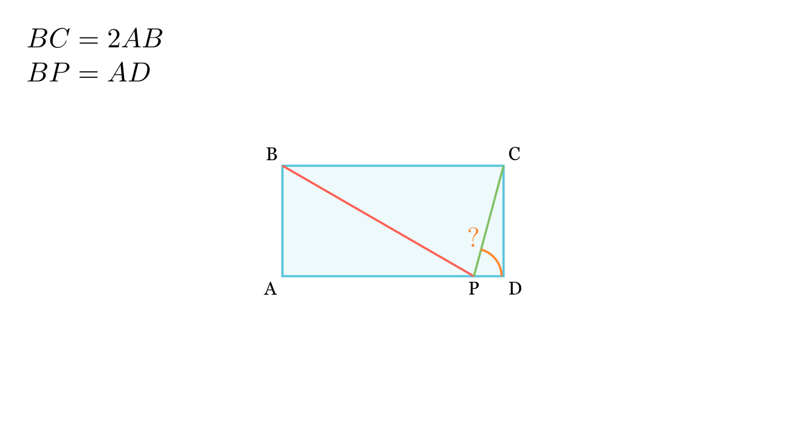

# Агол во правоаголник (30-60-90)

## Текст на задачата
Нека $ABCD$ е правоаголник таков што $BC = 2AB$. Нека $P$ е точка од страната $AD$ таква што $AD = BP$. Одреди ја големината на $\angle CPD$.

{ width=500 }

## 📐 Скица / Конструкција

## 🧠 Анализа
Во правоаголен триаголник, ако хипотенузата е двојно поголема од една катета, тој триаголник е 'половина од рамностран' (агли 30-60-90). Тука $BP = AD = BC = 2AB$.

## 📝 Решение (СИНТЕТИЧКО)
Нека $AB = a$. Тогаш $BC = AD = 2a$. Од условот $BP=AD$, следи $BP=2a$.

### Чекор 1: Триаголник $ABP$
Во правоаголниот $\triangle ABP$, имаме катета $AB=a$ и хипотенуза $BP=2a$.
Бидејќи односот е $1:2$, аголот спроти катетата е $30^\circ$:
$$ \angle APB = 30^\circ $$
Тогаш $\angle ABP = 60^\circ$.

### Чекор 2: Триаголник $PBC$
Имаме $BP=2a$ и $BC=2a$. Значи $\triangle PBC$ е **рамнокрак**.
Аголот при врвот $B$ е:
$$ \angle PBC = 90^\circ - 60^\circ = 30^\circ $$
Аглите при основата $PC$ се:
$$ \angle BPC = \frac{180^\circ - 30^\circ}{2} = 75^\circ $$

### Чекор 3: Бараниот агол
Аголот $\angle APD$ е рамен ($180^\circ$).
$$ \angle CPD = 180^\circ - (\angle APB + \angle BPC) $$
$$ \angle CPD = 180^\circ - (30^\circ + 75^\circ) = 180^\circ - 105^\circ = 75^\circ $$

**Резултат:** $\boxed{75^\circ}$.

## ⚠️ Аналитички пристап (само ако е неизбежен)
<Ако мора да се користат координати, објасни зошто синтетичкиот пат е претежок.>

## 🏁 Заклучок
Видете го решението погоре.