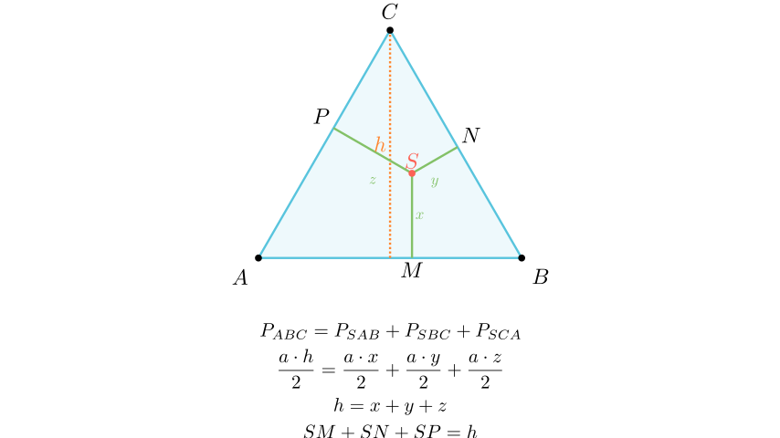

# Теорема на Вивиани

## Текст на задачата
Нека $S$ е произволна точка во внатрешноста на рамностран триаголник $ABC$, а $M, N, P$ се подножјата на нормалите од $S$ кон страните. Докажи дека $SM + SN + SP = h$, каде $h$ е висината на триаголникот.

## 📐 Скица / Конструкција

## 💡 Решение

Нека $a$ е должината на страната на рамностраниот триаголник $ABC$.
Плоштината на триаголникот $ABC$ може да се пресмета како:
$$ P_{ABC} = \frac{a \cdot h}{2} $$
каде $h$ е висината на триаголникот.

Од друга страна, ако ја поврземе точката $S$ со темињата $A, B, C$, триаголникот $ABC$ се дели на три помали триаголници: $\triangle SAB$, $\triangle SBC$ и $\triangle SCA$.
Плоштината на $ABC$ е збир од плоштините на овие три триаголници:
$$ P_{ABC} = P_{SAB} + P_{SBC} + P_{SCA} $$
Висините на овие триаголници спуштени од темето $S$ кон страните $AB, BC, CA$ се соодветно $SM, SN, SP$.
Бидејќи $\triangle ABC$ е рамностран, сите страни имаат должина $a$.
Затоа:
$$ P_{SAB} = \frac{a \cdot SM}{2}, \quad P_{SBC} = \frac{a \cdot SN}{2}, \quad P_{SCA} = \frac{a \cdot SP}{2} $$
Заменуваме во равенството за плоштини:
$$ \frac{a \cdot h}{2} = \frac{a \cdot SM}{2} + \frac{a \cdot SN}{2} + \frac{a \cdot SP}{2} $$
Делиме со $\frac{a}{2}$ (бидејќи $a \neq 0$):
$$ h = SM + SN + SP $$
Што требаше да се докаже. 
3. **Алгебарски приказ:** $\frac{ah}{2} = \frac{a \cdot SP}{2} + \frac{a \cdot SM}{2} + \frac{a \cdot SN}{2}$. 
4. **Упростување:** Бидејќи $a \neq 0$ и е исто за сите членови, ја делиме целата равенка со $\frac{a}{2}$. 
5. **Заклучок:** Добиваме $h = SP + SM + SN$.

## ⚠️ Аналитички пристап (само ако е неизбежен)
<Ако мора да се користат координати, објасни зошто синтетичкиот пат е претежок.>

## 🏁 Заклучок
Видете го решението погоре.