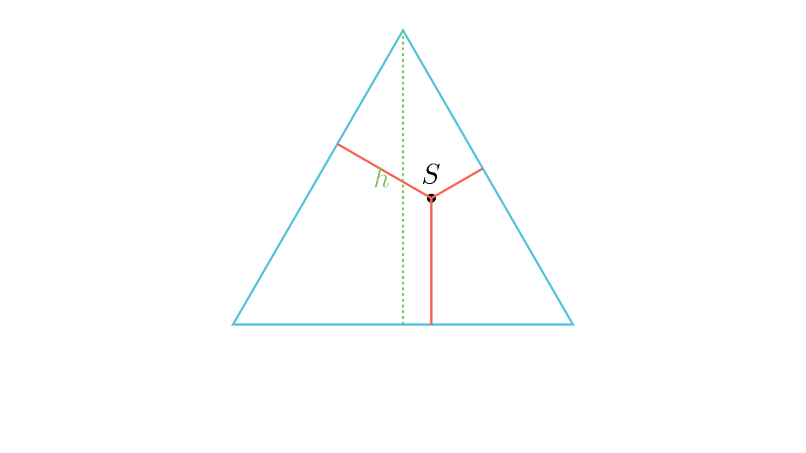

# Теорема на Вивиани

## Текст на задачата
Нека $S$ е произволна точка во внатрешноста на рамностран триаголник $ABC$, а $M, N, P$ се подножјата на нормалите од $S$ кон страните. Докажи дека $SM + SN + SP = h$, каде $h$ е висината на триаголникот.

## 📐 Скица / Конструкција

{ width=500 }

{ width=500 }
## 🧠 Анализа
Ова е специјален случај на идентитетот на нормали. Бидејќи сите страни се еднакви, плоштината се поедноставува драматично.

## 📝 Решение (СИНТЕТИЧКО)
1. **Поделба:** Поврзи ја точката $S$ со темињата $A, B, C$. 
2. **Сума на плоштини:** $P_{ABC} = P_{ABS} + P_{BCS} + P_{CAS}$. 
3. **Алгебарски приказ:** $\frac{ah}{2} = \frac{a \cdot SP}{2} + \frac{a \cdot SM}{2} + \frac{a \cdot SN}{2}$. 
4. **Упростување:** Бидејќи $a \neq 0$ и е исто за сите членови, ја делиме целата равенка со $\frac{a}{2}$. 
5. **Заклучок:** Добиваме $h = SP + SM + SN$.

## ⚠️ Аналитички пристап (само ако е неизбежен)
<Ако мора да се користат координати, објасни зошто синтетичкиот пат е претежок.>

## 🏁 Заклучок
Видете го решението погоре.