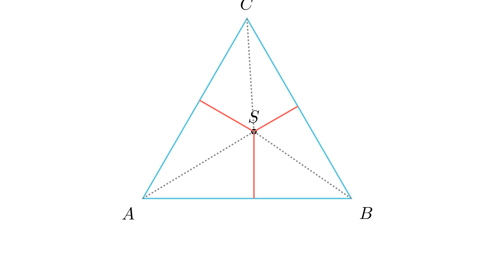

[⬅️ Назад кон Индексот](../README.md) | [🧰 Skill: triangle_decomposition](../../skill_guides/triangle_decomposition.md)

# Теорема на Вивиани

## 📝 Текст на задачата
Нека $S$ е произволна точка во внатрешноста на рамностран триаголник, а $M, N$ и $P$ се подножјата на нормалите од $S$ кон страните на триаголникот. Ако $h$ е висината во триаголникот, докажи дека $SM + SN + SP = h$.

## 📐 Скица

  

## 🧠 Анализа
**Стратегија:** Искористете го фактот дека целината е збир од нејзините делови. Поделете го големиот триаголник на три помали со заедничко теме во $S$.

## 💡 Решение

??? success "👀 Прикажи го решението"
    1. **Декомпозиција:** Нека страната на рамностраниот триаголник $ABC$ е $a$. Ја поврзуваме точката $S$ со темињата $A, B$ и $C$, делејќи го на $\triangle ABS, \triangle BCS$ и $\triangle CAS$.
    2. **Плоштини на деловите:** Плоштините на овие триаголници со основи $a$ и висини $SM, SN, SP$ се: $P_{BCS} = \frac{a \cdot SM}{2}$, $P_{CAS} = \frac{a \cdot SN}{2}$ и $P_{ABS} = \frac{a \cdot SP}{2}$.
    3. **Вкупна плоштина:** Плоштината на $\triangle ABC$ е $P = \frac{a \cdot h}{2}$.
    4. **Изедначување:** Бидејќи $P_{ABC} = P_{BCS} + P_{CAS} + P_{ABS}$, имаме $\frac{a \cdot h}{2} = \frac{a \cdot SM}{2} + \frac{a \cdot SN}{2} + \frac{a \cdot SP}{2}$.
    5. **Финале:** По кратење со $\frac{a}{2}$, добиваме $h = SM + SN + SP$.

## 🏁 Заклучок
Видете го решението погоре.
