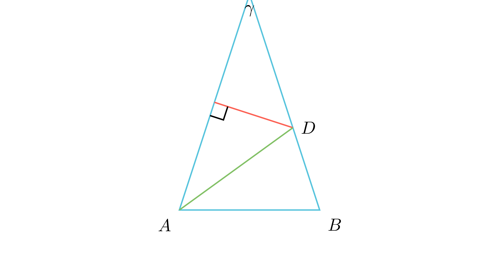

# Пресек на симетрала на страна и симетрала на агол

## Текст на задачата
Во рамнокракиот триаголник $ABC$ симетралата на кракот $AC$ и симетралата на $\angle BAC$ се сечат во точка $D$ која припаѓа на кракот $BC$. Определи го $\angle CDA$.

## 📐 Скица / Конструкција
<Опис на цртежот. Кои се клучните точки? Дали има помошни линии?>

  

## 🧠 Анализа
Секоја точка на симетрала на отсечка е еднакво оддалечена од нејзините краишта. Користи го ова за да формираш нов рамнокрак триаголник $ADC$.

## 📝 Решение (СИНТЕТИЧКО)
1. **Својство на симетрала:** Бидејќи $D$ е на симетралата на $AC$, следува $AD = CD$. Значи $\triangle ADC$ е рамнокрак и $\angle DAC = \angle DCA = \gamma$.
2. **Симетрала на агол:** Бидејќи $AD$ е симетрала на $\alpha$, следува $\alpha = 2\gamma$.
3. **Рамнокрак триаголник:** Триаголникот $ABC$ има краци $AC=BC$, па $\angle B = \angle A = \alpha = 2\gamma$.
4. **Равенка:** $\alpha + \alpha + \gamma = 180^\circ \implies 2\gamma + 2\gamma + \gamma = 180^\circ \implies 5\gamma = 180^\circ$, па $\gamma = 36^\circ$.
5. **Агол:** Во $\triangle ADC$, $\angle CDA = 180^\circ - 2\gamma = 180^\circ - 72^\circ = 108^\circ$.

## ⚠️ Аналитички пристап (само ако е неизбежен)
<Ако мора да се користат координати, објасни зошто синтетичкиот пат е претежок.>

## 🏁 Заклучок
Видете го решението погоре.