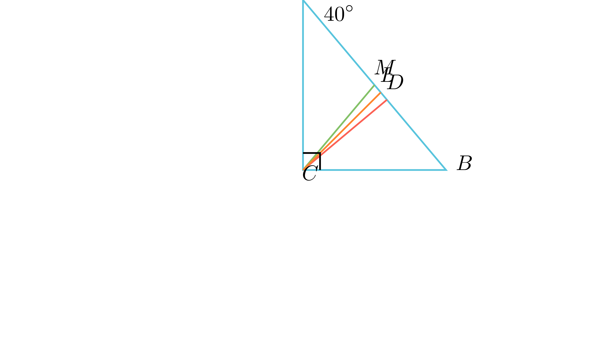

# Симетрала на агол меѓу висина и медијана

## Текст на задачата
Даден е правоаголен триаголник со агол $\angle A = 40^\circ$. Докажи дека симетралата на правиот агол го преполовува аголот кој го формираат висината и тежишната линија повлечени од темето на правиот агол.

## 📐 Скица / Конструкција

{ width=500 }
## 🧠 Анализа
Искористи го клучното својство дека тежишната линија кон хипотенузата формира два рамнокраки триаголници. Спореди ги аглите што висината и медијаната ги зафаќаат со катетите.

## 📝 Решение (СИНТЕТИЧКО)
1. **Агли:** $\angle A = 40^\circ, \angle B = 50^\circ$. Симетралата $CL$ го дели правиот агол на $45^\circ$ и $45^\circ$.
2. **Висина:** Во $\triangle DBC$, $\angle BCD = 90^\circ - 50^\circ = 40^\circ$.
3. **Медијана:** Бидејќи $CM = BM$, $\triangle MBC$ е рамнокрак и $\angle BCM = \angle B = 50^\circ$.
4. **Споредба:** Аголот меѓу висината и симетралата е $45^\circ - 40^\circ = 5^\circ$. Аголот меѓу медијаната и симетралата е $50^\circ - 45^\circ = 5^\circ$.
5. **Заклучок:** Бидејќи аглите се еднакви, симетралата го преполовува аголот меѓу нив.

## ⚠️ Аналитички пристап (само ако е неизбежен)
<Ако мора да се користат координати, објасни зошто синтетичкиот пат е претежок.>

## 🏁 Заклучок
Видете го решението погоре.