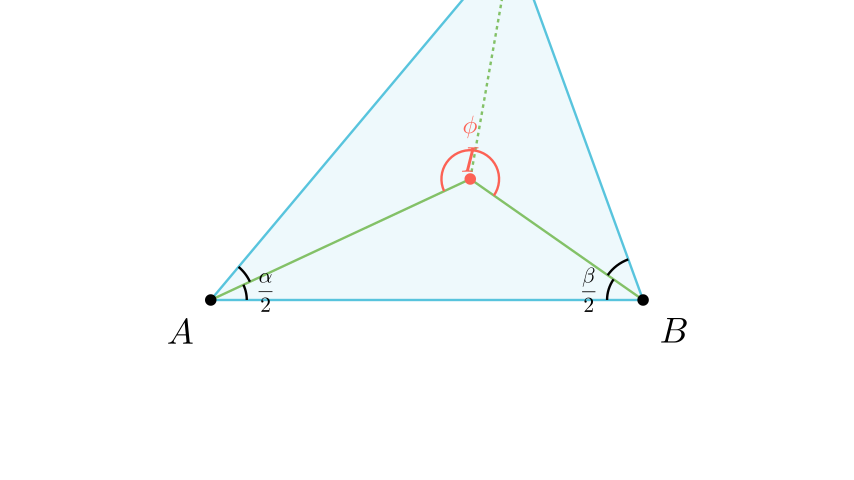

# Агол кај центарот на впишана кружница

## Текст на задачата
Нека $I$ е центарот на впишаната кружница во триаголникот $ABC$. Докажи дека аголот меѓу симетралите на аглите кај темињата $A$ и $B$ изнесува: $$\angle AIB = 90^\circ + \frac{\gamma}{2}$$ каде $\gamma$ е аголот кај темето $C$.

## 📐 Скица / Конструкција

## 💡 Решение

Нека $\alpha, \beta, \gamma$ се аглите на триаголникот $ABC$ кај темињата $A, B, C$ соодветно.
Бидејќи $AI$ и $BI$ се симетрали на аглите $\alpha$ и $\beta$, во триаголникот $ABI$ аглите се:
$$ \angle IAB = \frac{\alpha}{2}, \quad \angle IBA = \frac{\beta}{2} $$
Збирот на аглите во $\triangle ABI$ е $180^\circ$:
$$ \angle AIB + \frac{\alpha}{2} + \frac{\beta}{2} = 180^\circ $$
Оттука:
$$ \angle AIB = 180^\circ - \frac{\alpha + \beta}{2} $$
Во триаголникот $ABC$, збирот на аглите е $180^\circ$, па $\alpha + \beta = 180^\circ - \gamma$.
Заменуваме во изразот за $\angle AIB$:
$$ \angle AIB = 180^\circ - \frac{180^\circ - \gamma}{2} $$
$$ \angle AIB = 180^\circ - \left( 90^\circ - \frac{\gamma}{2} \right) $$
$$ \angle AIB = 90^\circ + \frac{\gamma}{2} $$
Што требаше да се докаже. 
