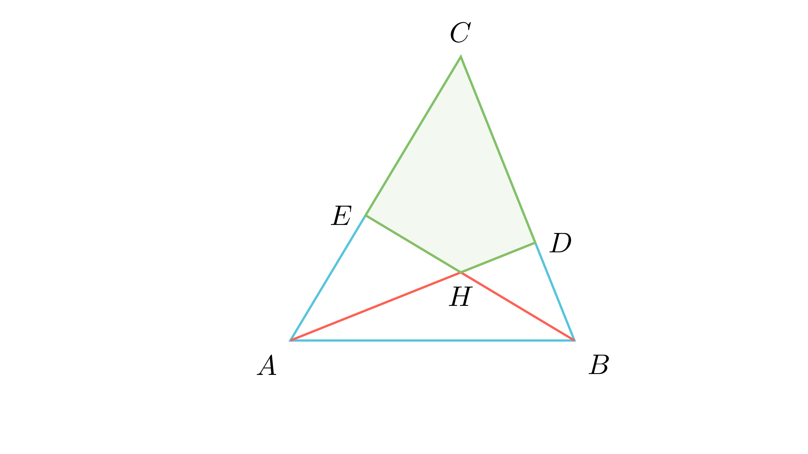

# Агол кај ортоцентарот

## Текст на задачата
Нека $H$ е ортоцентарот (пресекот на висините) во триаголникот $ABC$. Докажи дека аголот меѓу висините повлечени од темињата $A$ и $B$ е суплементен на аголот кај темето $C$: $$\angle AHB = 180^\circ - \gamma$$

## 📐 Скица / Конструкција

{ width=500 }
## 🧠 Анализа
Наместо триаголник, фокусирај се на четириаголникот формиран од ортоцентарот, двете подножја на висините и темето $C$.

## 📝 Решение (СИНТЕТИЧКО)
1. **Конструкција:** Нека $AD \perp BC$ и $BE \perp AC$. Пресекот е $H$. 
2. **Четириаголник CDHE:** Во четириаголникот $CDHE$, аглите кај $D$ и $E$ се по $90^\circ$. 
3. **Сума на агли:** Збирот во четириаголник е $360^\circ$. Па, $\gamma + 90^\circ + \angle DHE + 90^\circ = 360^\circ$. 
4. **Резултат за $\angle DHE$:** $\angle DHE = 180^\circ - \gamma$. 
5. **Врска со $\angle AHB$:** Аглите $\angle AHB$ и $\angle DHE$ се накрсни, па $\angle AHB = 180^\circ - \gamma$.

## ⚠️ Аналитички пристап (само ако е неизбежен)
<Ако мора да се користат координати, објасни зошто синтетичкиот пат е претежок.>

## 🏁 Заклучок
Видете го решението погоре.