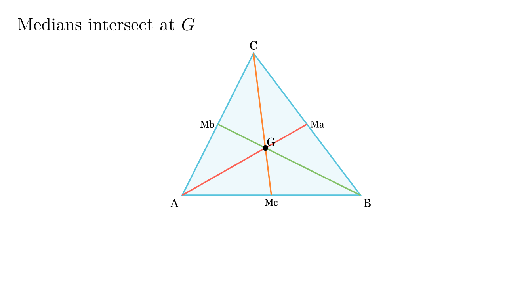

---
allowed_tools:
- classical_euclidean
- similarity
- symmetry
difficulty: 5
field: geometry
forbidden_tools:
- coordinate_geometry
- vectors
- complex_numbers
geometry_style: synthetic
grade: 8
language_original: <mk | en | sr | hr | ...>
primary_skill: <main_tool>
problem_id: centroid_proof
related_skills:
- cevas_theorem
- homothety
related_theorems:
- cevas_theorem
source: <натпревар / списание / година>
tags:
- geometry
- olympiad
translated: false
---

# Тежишните линии се сечат во една точка (Тежиште)

## Текст на задачата
Докажи дека трите тежишни линии во произволен триаголник се сечат во една точка (тежиште).

{ width=500 }

## 📐 Скица / Конструкција

## 🧠 Анализа
Ова е фундаментална теорема. Ќе понудиме два пристапа: еден преку плоштини (интуитивен) и еден преку Чева (моќен).

## 📝 Решение (СИНТЕТИЧКО)
### Решение 1: Метод на плоштини (Основен пристап)
Ова решение не бара напредни теореми.

Нека $AD$ и $BE$ се тежишни линии кои се сечат во точка $T$. Ќе докажеме дека и третата тежишна линија $CF$ минува низ $T$.
1. Бидејќи $D$ е средина на $BC$, триаголниците $\triangle ABD$ и $\triangle ACD$ имаат исти основи и иста висина, па имаат исти плоштини: $P_{ABD} = P_{ACD}$.
2. Истото важи и за малите триаголници: $P_{TBD} = P_{TCD}$.
3. Ако ги одземеме, добиваме: $P_{ABT} = P_{ACT}$.
4. Аналогно, користејќи ја тежишната линија $BE$, добиваме $P_{ABT} = P_{BCT}$.
5. Заклучок: $P_{ABT} = P_{BCT} = P_{CAT}$. Трите триаголници кон тежиштето имаат иста плоштина.
6. Сега, нека правата $CT$ ја сече $AB$ во $F'$. Бидејќи $P_{ACT} = P_{BCT}$, а тие имаат иста висина кон $AB$, следи дека нивните основи мора да се еднакви: $AF' = F'B$. Значи $F'$ е средина, што значи $CF'$ е тежишна линија. Доказот е завршен.

---

### Решение 2: Чева (Напреден пристап)
Ова решение користи **Чева теорема**. Бидејќи ова е првпат да ја користиме, ќе ја дефинираме.

> **Лема (Чева Теорема):** Во $\triangle ABC$, правите $AD, BE, CF$ се сечат во една точка ако и само ако:
> $$ \frac{AF}{FB} \cdot \frac{BD}{DC} \cdot \frac{CE}{EA} = 1 $$

**Доказ за задачата:**
Бидејќи $AD, BE, CF$ се тежишни линии, точките $D, E, F$ се средини на страните.
Тоа значи:
$$ AF = FB \implies \frac{AF}{FB} = 1 $$
$$ BD = DC \implies \frac{BD}{DC} = 1 $$
$$ CE = EA \implies \frac{CE}{EA} = 1 $$

Го проверуваме условот на Чева:
$$ 1 \cdot 1 \cdot 1 = 1 $$
Условот е исполнет. Значи, тежишните линии се сечат во една точка.

## ⚠️ Аналитички пристап (само ако е неизбежен)
<Ако мора да се користат координати, објасни зошто синтетичкиот пат е претежок.>

## 🏁 Заклучок
Видете го решението погоре.