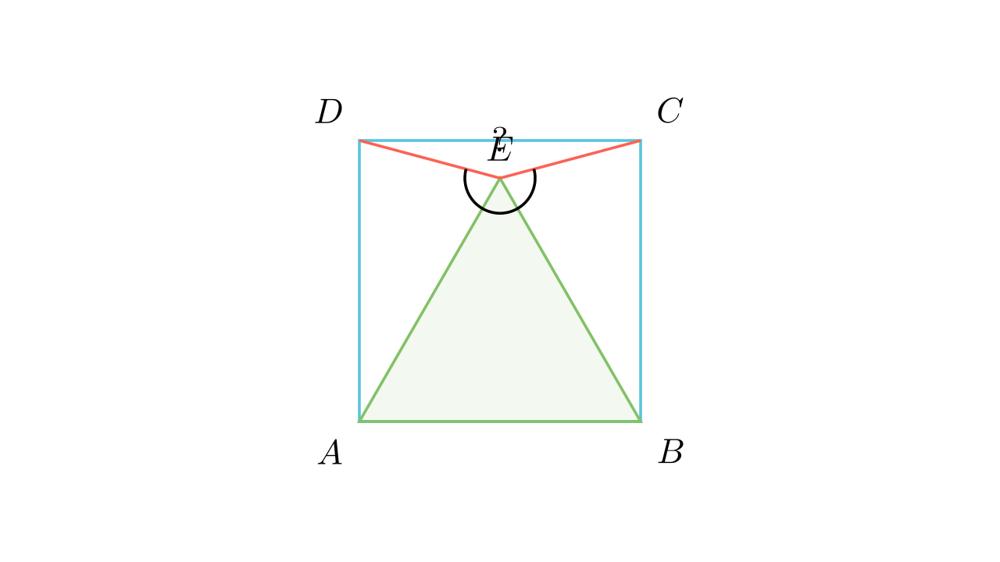
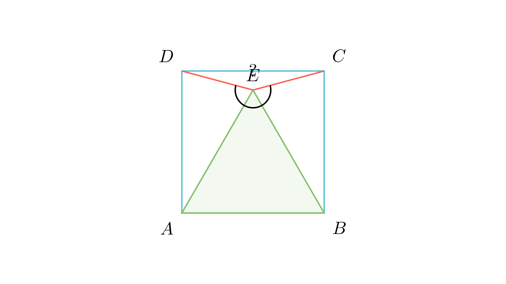

# Рамностран триаголник во квадрат

## Текст на задачата
Даден е квадрат $ABCD$. Во неговата внатрешност е избрана точка $E$ така што $\triangle ABE$ е рамностран. Пресметај ја големината на аголот $\angle DEC$.

## 📐 Скица / Конструкција

{ width=500 }

## 🧠 Анализа
**Зошто е оваа задача тешка?**
Клучот е да се забележи дека страните на квадратот и рамностраниот триаголник се еднакви. Ова создава рамнокраки триаголници ($\triangle ADE$ и $\triangle BCE$) кои овозможуваат пресметка на аглите.

**Конструктивен потег:**
Искористи го фактот дека $AD = AB$ (страни на квадрат) и $AB = AE$ (страни на рамностран триаголник), па заклучи дека $\triangle ADE$ е рамнокрак.

## 💡 Решение
1.  Бидејќи $ABCD$ е квадрат, сите страни се еднакви: $AB = BC = CD = DA$. Аглите се $90^\circ$.
2.  Бидејќи $\triangle ABE$ е рамностран, сите страни се еднакви: $AB = AE = BE$. Аглите се $60^\circ$.
3.  Од (1) и (2) следи дека $AD = AE$. Значи, $\triangle ADE$ е рамнокрак.
4.  Аголот при врвот $A$ на $\triangle ADE$ е:
    $$ \angle DAE = \angle DAB - \angle EAB = 90^\circ - 60^\circ = 30^\circ $$
5.  Аглите при основата на рамнокракиот $\triangle ADE$ се:
    $$ \angle ADE = \angle AED = \frac{180^\circ - 30^\circ}{2} = 75^\circ $$
6.  Аналогно, за $\triangle BCE$ (кој е исто така рамнокрак со $BC=BE$):
    $$ \angle BCE = \angle ABC - \angle ABE = 90^\circ - 60^\circ = 30^\circ $$
    $$ \angle BEC = \frac{180^\circ - 30^\circ}{2} = 75^\circ $$
7.  Аголот $\angle DEC$ го наоѓаме преку полниот агол околу точката $E$ (или преку збирот на агли во $\triangle CDE$, но полесно е околу $E$ ако ги знаеме сите, чекај, $E$ не е центар).
    Всушност, $E$ е внатрешна точка. Аглите околу $E$ се $\angle AEB = 60^\circ$, $\angle AED = 75^\circ$, $\angle BEC = 75^\circ$.
    Збирот е $60^\circ + 75^\circ + 75^\circ + \angle DEC = 360^\circ$.
    $$ 210^\circ + \angle DEC = 360^\circ $$
    $$ \angle DEC = 150^\circ $$

Конечниот одговор е $150^\circ$.

{ width=500 }

{ width=500 }
## 🧠 Анализа
Ова е класична задача. Клучот е да ги искористиш еднаквостите на страните. Бидејќи $ABCD$ е квадрат, $AB=BC=CD=DA$. Бидејќи $\triangle ABE$ е рамностран, $AB=AE=BE$. Заклучокот е дека $AE=AD$ и $BE=BC$. Ова формира два скриени рамнокраки триаголници: $\triangle ADE$ и $\triangle BCE$.

## 📝 Решение (СИНТЕТИЧКО)
### Чекор 1: Анализа на страните
Од својствата на квадратот и рамностраниот триаголник имаме:
1. $AB = BC = CD = DA$ (страни на квадрат).
2. $AB = AE = BE$ (страни на рамностран триаголник).

Од (1) и (2) следи транзитивноста:
$$ AD = AE \quad \text{и} \quad BC = BE $$

### Чекор 2: Ловење агли во $\triangle ADE$
Бидејќи $AD = AE$, триаголникот $\triangle ADE$ е **рамнокрак**.
Аголот при врвот $A$ е:
$$ \angle DAE = \angle DAB - \angle EAB = 90^\circ - 60^\circ = 30^\circ $$
Аглите при основата $DE$ се еднакви:
$$ \angle ADE = \angle AED = \frac{180^\circ - 30^\circ}{2} = 75^\circ $$

### Чекор 3: Ловење агли во $\triangle BCE$
Аналогно, $\triangle BCE$ е рамнокрак ($BC=BE$).
Аголот при врвот $B$ е:
$$ \angle CBE = \angle CBA - \angle EBA = 90^\circ - 60^\circ = 30^\circ $$
Аглите при основата $CE$ се:
$$ \angle BCE = \angle BEC = \frac{180^\circ - 30^\circ}{2} = 75^\circ $$

### Чекор 4: Пресметка на $\angle DEC$
Аголот $\angle DEC$ може да се најде на два начина.
**Начин А (Преку полн агол околу E):**
$$ \angle DEC = 360^\circ - (\angle AEB + \angle AED + \angle BEC) $$
$$ \angle DEC = 360^\circ - (60^\circ + 75^\circ + 75^\circ) = 360^\circ - 210^\circ = 150^\circ $$

**Начин Б (Преку аглите на квадратот):**
Во $\triangle CDE$, аглите при основата $CD$ се:
$\angle EDC = \angle ADC - \angle ADE = 90^\circ - 75^\circ = 15^\circ$.
$\angle ECD = \angle BCD - \angle BCE = 90^\circ - 75^\circ = 15^\circ$.
Тогаш:
$$ \angle DEC = 180^\circ - (15^\circ + 15^\circ) = 180^\circ - 30^\circ = 150^\circ $$

**Резултат:** $\angle DEC = 150^\circ$.

## ⚠️ Аналитички пристап (само ако е неизбежен)
<Ако мора да се користат координати, објасни зошто синтетичкиот пат е претежок.>

## 🏁 Заклучок
Видете го решението погоре.