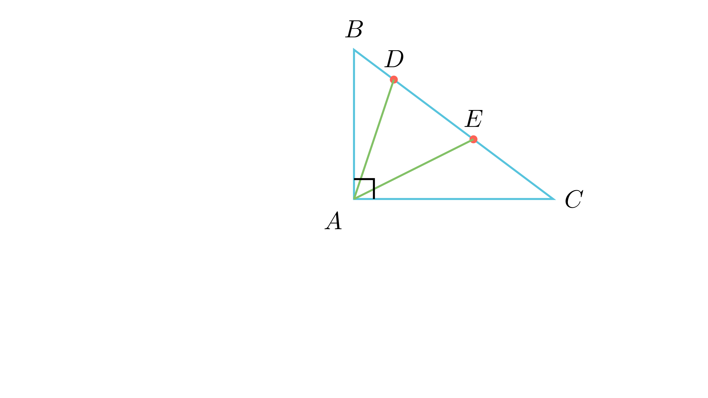

# Агол на преклопување на хипотенуза

## Текст на задачата
На хипотенузата $BC$ во правоаголниот триаголник $ABC$ дадени се точките $D$ и $E$ такви што $BE = AB$ и $CD = AC$. Пресметај го аголот $\angle DAE$.

## 📐 Скица / Конструкција

{ width=500 }

{ width=500 }
## 🧠 Анализа
Аголот $\angle DAE$ е всушност 'вишокот' што се појавува кога ќе ги собереш аглите на двата рамнокраки триаголници внатре во правиот агол.

## 📝 Решение (СИНТЕТИЧКО)
1. **Рамнокраки триаголници:** $\triangle ABE$ е рамнокрак со врв во $B$, па $\angle BAE = 90 - \frac{\beta}{2}$. 
2. **Втор триаголник:** $\triangle ACD$ е рамнокрак со врв во $C$, па $\angle CAD = 90 - \frac{\gamma}{2}$. 
3. **Преклопување:** $\angle DAE = \angle BAE + \angle CAD - \angle BAC$. 
4. **Замена:** $\angle DAE = (90 - \frac{\beta}{2}) + (90 - \frac{\gamma}{2}) - 90 = 90 - \frac{\beta + \gamma}{2}$. 
5. **Финале:** Бидејќи $\beta + \gamma = 90$ (остри агли), тогаш $\angle DAE = 90 - 45 = 45^\circ$.

## ⚠️ Аналитички пристап (само ако е неизбежен)
<Ако мора да се користат координати, објасни зошто синтетичкиот пат е претежок.>

## 🏁 Заклучок
Видете го решението погоре.