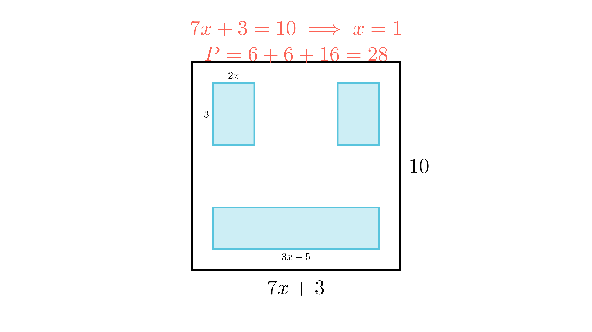

[⬅️ Назад кон Индексот](../README.md) | [🧰 Skill: visual_reasoning](../../skill_guides/visual_reasoning.md)

# Квадрат со впишани правоаголници

## 📝 Текст на задачата
Во квадрат се впишани три правоаголника (види слика). Страната на квадратот е означена со $7x+3$ (долу) и 10 (десно). Димензиите на правоаголниците се дадени преку $x$. Колкав процент од плоштината на квадратот зафаќаат трите правоаголници?

## 📐 Скица

  

## 🧠 Анализа
**Зошто е оваа задача тешка?**
Прво најдете ја вредноста на $x$ користејќи ја страната на квадратот. Дадено е дека страната е 10, а долу пишува $7x+3$. Израмнете ги. Откако ќе го најдете $x$, пресметајте ги димензиите и плоштините на малите правоаголници.

**Конструктивен потег:**
Прво најдете ја вредноста на $x$ користејќи ја страната на квадратот. Дадено е дека страната е 10, а долу пишува $7x+3$. Израмнете ги. Откако ќе го најдете $x$, пресметајте ги димензиите и плоштините на малите правоаголници.

## 💡 Решение

??? tip "Чекор 1: Наоѓање на $x$"
    Страната на квадратот е 10.
    Од долната страна: $7x + 3 = 10$.
    $$ 7x = 7 \implies x = 1 $$

??? tip "Чекор 2: Плоштина на квадратот"
    $$ P_{kv} = 10^2 = 100 $$

??? tip "Чекор 3: Плоштини на правоаголниците"
    Заменуваме $x=1$ во димензиите од сликата:
    1.  Горе лево: Висина 3, Ширина $2x = 2$. $P_1 = 3 \cdot 2 = 6$.
    2.  Горе десно: Висина 3, Ширина $2x = 2$. $P_2 = 3 \cdot 2 = 6$.
    3.  Долу: Висина 2, Ширина $3x+5 = 3(1)+5 = 8$. $P_3 = 2 \cdot 8 = 16$.

??? tip "Чекор 4: Вкупна плоштина и процент"
    $$ P_{vk} = 6 + 6 + 16 = 28 $$
    Процент: $\frac{28}{100} = 28\%$.

## 🏁 Заклучок
Видете го решението погоре.

## 👩‍🏫 За наставници
Задачата бара комбинирање на алгебра (наоѓање на x) и геометрија. Проверката е важна: Дали ширините се вклопуваат? $2x + \text{празнина} + 2x = 10$? Не е дадено, но се претпоставува дека се внатре.