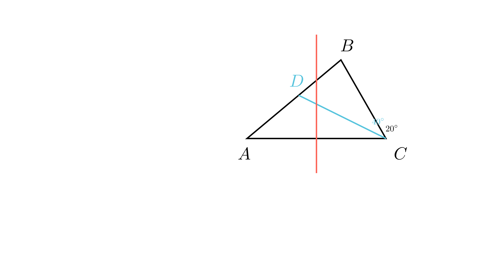

[⬅️ Назад кон Индексот](../README.md) | [🧰 Skill: angle_chasing](../../skill_guides/angle_chasing.md)

# Симетрала на страна во триаголник

## 📝 Текст на задачата
Во триаголникот $ABC$ со агол во темето $C$ од $60^\circ$, симетралата на страната $AC$ ја сече страната $AB$ во точката $D$. Ако аголот $ACD$ е двапати поголем од аголот $DCB$, определи ги другите агли на тој триаголник.

## 📐 Скица

{ width=500 }
## 🧠 Анализа
**Зошто е оваа задача тешка?**
Внимавајте: се работи за симетрала на **страна** ($s_{AC}$), а не на агол. Точката $D$ лежи на симетралата на $AC$, што значи дека е еднакво оддалечена од $A$ и $C$ ($AD=CD$). Ова формира рамнокрак триаголник $\triangle ADC$. Прво најдете ги деловите на аголот $C$.

**Конструктивен потег:**
Внимавајте: се работи за симетрала на **страна** ($s_{AC}$), а не на агол. Точката $D$ лежи на симетралата на $AC$, што значи дека е еднакво оддалечена од $A$ и $C$ ($AD=CD$). Ова формира рамнокрак триаголник $\triangle ADC$. Прво најдете ги деловите на аголот $C$.

## 💡 Решение

??? tip "Чекор 1: Пресметка на деловите на аголот C"
    Дадено е $\angle C = 60^\circ$. Нека $\angle DCB = x$. Тогаш $\angle ACD = 2x$.
    $$ x + 2x = 60^\circ \implies 3x = 60^\circ \implies x = 20^\circ $$
    Значи $\angle ACD = 40^\circ$ и $\angle DCB = 20^\circ$.

??? tip "Чекор 2: Својство на симетрала на страна"
    Бидејќи $D$ лежи на симетралата на $AC$, важи $AD = CD$.
    Следи дека $\triangle ADC$ е рамнокрак со основа $AC$.
    Аглите при основата се еднакви: $\angle A = \angle ACD = 40^\circ$.

??? tip "Чекор 3: Пресметка на аголот B"
    Збирот на аглите во $\triangle ABC$ е $180^\circ$.
    $$ \angle B = 180^\circ - (\angle A + \angle C) $$
    $$ \angle B = 180^\circ - (40^\circ + 60^\circ) = 180^\circ - 100^\circ = 80^\circ $$
    
    **Одговор:** Аглите се $\angle A = 40^\circ$ и $\angle B = 80^\circ$.

## 🏁 Заклучок
Видете го решението погоре.

## 👩‍🏫 За наставници
Најчеста грешка е учениците да мислат дека $CD$ е симетрала на аголот $C$ (па $30-30$). Текстот прецизно вели „симетрала на страната $AC$“.