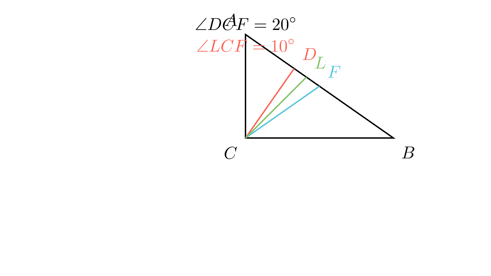

[⬅️ Назад кон Индексот](../../README.md) | [🧰 Skill: angle_chasing](../../../tools/skill_guides/angle_chasing.md)

# Агли во правоаголен триаголник

## 📝 Текст на задачата
Даден е правоаголен $\triangle ABC$ ($\,angle C = 90^\circ$). Нека $CD$ е висината, а $CF$ е тежишната линија кон хипотенузата. Ако аголот меѓу висината и тежишната линија е $\angle DCF = 20^\circ$, одреди го аголот меѓу симетралата на правиот агол ($CL$) и тежишната линија $CF$.

## 📐 Скица

> **👨‍💻 Geo-Mentor Code:**
> Одете во `assets/manim_code_log.md`, копирајте го кодот за `Task_2024_mun_g8_4` и генерирајте ја сликата.

> **👨‍💻 Geo-Mentor Code:**
> Одете во `assets/manim_code_log.md`, копирајте го кодот за `Task_2024_mun_g8_4` и генерирајте ја сликата.

## 🧠 Анализа
**Зошто е оваа задача тешка?**
Ова е класична конфигурација. Тежишната линија кон хипотенузата го дели триаголникот на два рамнокраки триаголници ($CF=AF=BF$). Затоа $\angle FCA = \angle A$. Висината $CD$ прави $\angle BCD = \angle A$ (агли со нормални краци). Значи $\angle DCF = |\angle A - \angle B|$. Симетралата $CL$ го дели правиот агол на $45^\circ$.

**Конструктивен потег:**
Ова е класична конфигурација. Тежишната линија кон хипотенузата го дели триаголникот на два рамнокраки триаголници ($CF=AF=BF$). Затоа $\angle FCA = \angle A$. Висината $CD$ прави $\angle BCD = \angle A$ (агли со нормални краци). Значи $\angle DCF = |\angle A - \angle B|$. Симетралата $CL$ го дели правиот агол на $45^\circ$.

## 💡 Решение

👀 Прикажи го решението

**Чекор 1: Врска меѓу аглите**
Нека $\angle A = \alpha$ и $\angle B = \beta$. ($\alpha + \beta = 90^\circ$).
*   Во правоаголен триаголник, тежишната линија $CF$ е еднаква на половина хипотенуза, па $\triangle AFC$ е рамнокрак. Следи $\angle FCA = \alpha$.
*   Висината $CD$ формира $\triangle ADC \sim \triangle CDB \sim \triangle ACB$. Следи $\angle BCD = \alpha$.

**Чекор 2: Пресметка на $\alpha$ и $\beta$**
Аголот меѓу висината и тежишната линија е $\angle DCF = |\angle FCA - \angle BCD|$? Не, тие се на различни страни? 
Всушност, редоследот на зраците од $CA$ кон $CB$ е: $CA$, $CF$ (тежишна), $CL$ (симетрала), $CD$ (висина), $CB$ (ако $\alpha > \beta$).
Или обратно. Важи идентитетот $\angle DCF = |\alpha - \beta|$.
Дадено е $|\alpha - \beta| = 20^\circ$.
Имаме систем:
1. $\alpha + \beta = 90^\circ$
2. $\alpha - \beta = 20^\circ$ (без губење на општост, нека $\alpha > \beta$)

Собираме: $2\alpha = 110^\circ \implies \alpha = 55^\circ$. Тогаш $\beta = 35^\circ$.

**Чекор 3: Агол меѓу симетрала и тежишна**
Симетралата $CL$ зафаќа агол $45^\circ$ со катетата $AC$.
Тежишната линија $CF$ зафаќа агол $\angle FCA = \alpha = 55^\circ$ со катетата $AC$.
Бараниот агол е разликата:
$$ \angle LCF = |\angle FCA - \angle LCA| = |55^\circ - 45^\circ| = 10^\circ $$

**Одговор:** Аголот е $10^\circ$.

## 🏁 Заклучок
<Краен резултат.>

## 👩‍🏫 За наставници
Интересно својство: Симетралата на правиот агол е секогаш симетрала и на аголот меѓу висината и тежишната линија. Затоа $\angle LCF = \angle LCD = 20^\circ / 2 = 10^\circ$. Ова е најбрзиот начин!