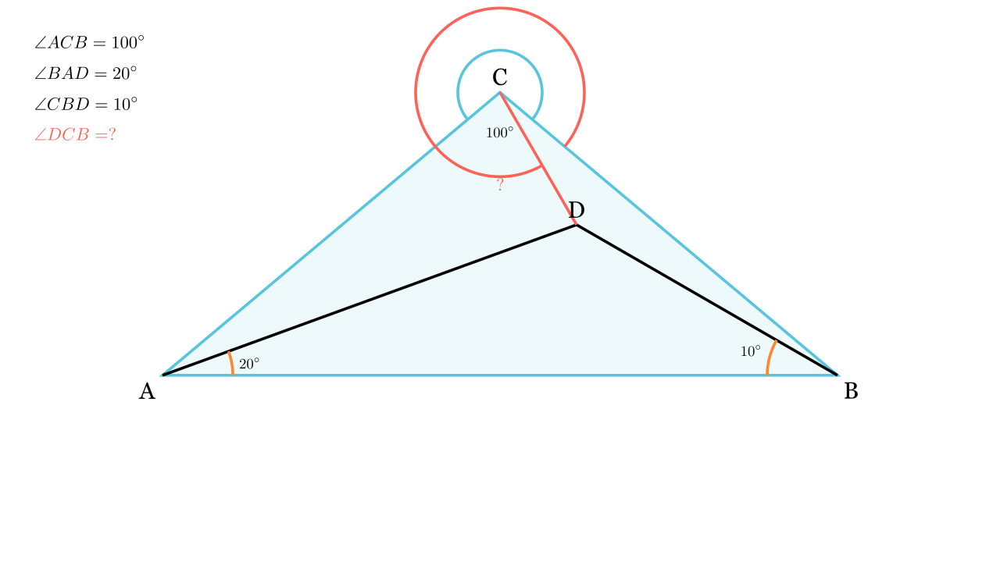

---
allowed_tools:
- classical_euclidean
- similarity
- symmetry
difficulty: 7
field: geometry
forbidden_tools:
- coordinate_geometry
- vectors
- complex_numbers
geometry_style: synthetic
grade: 8
language_original: <mk | en | sr | hr | ...>
primary_skill: <main_tool>
problem_id: 4419
related_skills:
- trigonometry
- construction
- similarity
related_theorems:
- cevas_theorem
source: <натпревар / списание / година>
tags:
- geometry
- olympiad
translated: false
---

# Агли во рамнокрак триаголник (Langley Variant)

## Текст на задачата
Нека $\triangle ABC$ е рамнокрак со основа $AB$ и $\angle ACB = 100^\circ$. Нека $D$ е точка во внатрешноста на $\triangle ABC$ таква што $\angle CBD = 10^\circ$ и $\angle BAD = 20^\circ$. Одреди ја големината на $\angle DCB$.

## 📐 Скица / Конструкција

{ width=500 }

{ width=500 }

## 🧠 Анализа
Ова е тешка задача од типот 'Adventitious Angles'. Обичното ловење агли ќе ве врти во круг. Клучот е да се забележи дека $AD$ е симетрала на аголот $\angle A$ (бидејќи целиот агол е $40^\circ$, а делот е $20^\circ$). Може да се користи тригонометриска форма на Чева или помошна конструкција.

## 📝 Решение (СИНТЕТИЧКО)
Дадено е: $\angle C = 100^\circ$, $AC=BC$. Значи аглите при основата се $\angle A = \angle B = \frac{180-100}{2} = 40^\circ$.
Дадено е: $\angle CBD = 10^\circ$ (значи $\angle ABD = 30^\circ$) и $\angle BAD = 20^\circ$ (значи $\angle CAD = 20^\circ$).

### Метод: Тригонометриска форма на Чева
Нека $\angle DCB = x$. Тогаш $\angle ACD = 100^\circ - x$.
Применуваме Чева за точката $D$ во $\triangle ABC$:
$$ \frac{\sin(\angle BAD)}{\sin(\angle CAD)} \cdot \frac{\sin(\angle ACD)}{\sin(\angle BCD)} \cdot \frac{\sin(\angle CBD)}{\sin(\angle ABD)} = 1 $$

Заменуваме со вредностите:
$$ \frac{\sin(20^\circ)}{\sin(20^\circ)} \cdot \frac{\sin(100^\circ - x)}{\sin(x)} \cdot \frac{\sin(10^\circ)}{\sin(30^\circ)} = 1 $$

Кратиме и средуваме (знаејќи дека $\sin(30^\circ) = 0.5$):
$$ 1 \cdot \frac{\sin(100^\circ - x)}{\sin(x)} \cdot \frac{\sin(10^\circ)}{0.5} = 1 $$
$$ \frac{\sin(100^\circ - x)}{\sin(x)} = \frac{0.5}{\sin(10^\circ)} $$
$$ \frac{\sin(x)}{\sin(100^\circ - x)} = 2\sin(10^\circ) $$

Оваа равенка има единствено решение за $x \in (0, 100)$. Ќе докажеме дека $x=20^\circ$ е решението.
Ако $x=20^\circ$, левата страна е:
$$ \frac{\sin(20^\circ)}{\sin(80^\circ)} = \frac{2\sin(10^\circ)\cos(10^\circ)}{\cos(10^\circ)} = 2\sin(10^\circ) $$
Ова е точно еднакво на десната страна!

**Заклучок:** $\angle DCB = \boxed{20^\circ}$.

## ⚠️ Аналитички пристап (само ако е неизбежен)
<Ако мора да се користат координати, објасни зошто синтетичкиот пат е претежок.>

## 🏁 Заклучок
Видете го решението погоре.