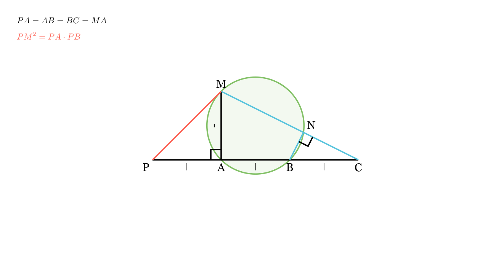

---
allowed_tools:
- classical_euclidean
- similarity
- symmetry
difficulty: 6
field: geometry
forbidden_tools:
- coordinate_geometry
- vectors
- complex_numbers
geometry_style: synthetic
grade: 8
language_original: <mk | en | sr | hr | ...>
primary_skill: <main_tool>
problem_id: 4421
related_skills:
- power_of_a_point
- tangent_properties
- angle_chasing
related_theorems:
- pythagorean_theorem
source: <натпревар / списание / година>
tags:
- geometry
- olympiad
translated: false
---

# Тетивен четириаголник и тангента

## Текст на задачата
На полуправата $PX$, земени се точките $A, B$ и $C$ (по редослед $P, A, B, C$), така што $PA=AB=BC$. Во точката $A$ е конструирана нормала на полуправата $PX$ и на неа е избрана точка $M$ така што $MA=AB$. Нека точката $N$ е пресечната точка на правата $MC$ и нормалата повлечена од точката $B$ кон правата $MC$. Докажи дека:
а) Четириаголникот $ABNM$ е тетивен;
б) $PM$ е тангента на опишаната кружница околу четириаголникот $ABNM$.

## 📐 Скица
{ width=500 }

## 📐 Скица / Конструкција

{ width=500 }

## 🧠 Анализа
За делот под а), барај прави агли кои 'гледаат' во иста отсечка. За делот под б), најелегантен начин е преку 'Степен на точка' (Power of a Point). Провери дали важи $PM^2 = PA \cdot PB$.

## 📝 Решение (СИНТЕТИЧКО)
Нека должината на сегментите е $a$. Значи $PA=AB=BC=MA=a$.

### Дел а) Доказ дека $ABNM$ е тетивен
1. Дадено е дека $MA \perp PX$, што значи $\angle MAB = 90^\circ$.
2. Дадено е дека $BN \perp MC$, што значи $\angle BNM = 90^\circ$.
3. Во четириаголникот $ABNM$, темињата $A$ и $N$ лежат на иста страна од дијагоналата $BM$ и важи $\angle BAM = \angle BNM = 90^\circ$.
4. Ова е доволен услов четириаголникот да биде тетивен (точките лежат на кружница со дијаметар $BM$).

### Дел б) Доказ за тангента (Метод на Степен на точка)
За правата $PM$ да биде тангента на кружницата опишана околу $ABNM$, доволно е да важи равенството:
$$ PM^2 = PA \cdot PB $$

**Пресметка на левата страна:**
Во правоаголниот $\triangle PAM$ (бидејќи $MA \perp PA$):
- $PA = a$
- $MA = a$
Според Питагорова теорема:
$$ PM^2 = PA^2 + MA^2 = a^2 + a^2 = 2a^2 $$

**Пресметка на десната страна:**
- $PA = a$
- $PB = PA + AB = a + a = 2a$
Производот е:
$$ PA \cdot PB = a \cdot 2a = 2a^2 $$

**Заклучок:**
Бидејќи $PM^2 = PA \cdot PB$, според обратната теорема за степен на точка, $PM$ е тангента на кружницата што минува низ $A$ и $B$ (кружницата на $ABNM$).

## ⚠️ Аналитички пристап (само ако е неизбежен)
<Ако мора да се користат координати, објасни зошто синтетичкиот пат е претежок.>

## 🏁 Заклучок
Видете го решението погоре.