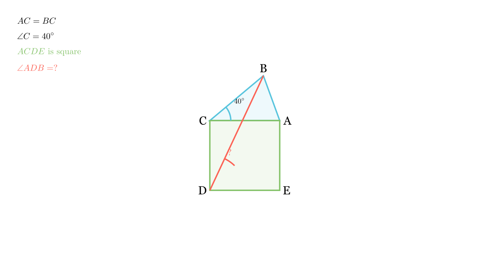

# Агол во конструкција со квадрат

## Текст на задачата
Даден е рамнокрак $\triangle ABC$ со основа $AB$ и агол при врвот $\angle C = 40^\circ$. Над кракот $AC$ е конструиран квадрат $ACDE$ кон надворешноста. Пресметај го $\angle ADB$.

## 📐 Скица / Конструкција

{ width=500 }

{ width=500 }

## 🧠 Анализа
Искористи ги еднаквостите на страните. $AC=BC$ (од триаголникот) и $AC=CD$ (од квадратот). Ова значи дека $\triangle BCD$ е рамнокрак. Исто така $\triangle ACD$ е правоаголен рамнокрак.

## 📝 Решение (СИНТЕТИЧКО)
1. **Анализа на $\triangle ABC$:**
   Рамнокрак со врв $40^\circ$. Аглите при основата се $\frac{180-40}{2} = 70^\circ$.
   Страни: $AC = BC$.

2. **Анализа на квадратот $ACDE$:**
   Страни: $AC = CD = DE = EA$.
   Агли: $\angle ACD = 90^\circ$.

3. **Анализа на $\triangle BCD$:**
   Бидејќи $BC = AC$ и $AC = CD$, следи **$BC = CD$**.
   Значи $\triangle BCD$ е рамнокрак.
   Аголот при врвот е $\angle BCD = \angle BCA + \angle ACD = 40^\circ + 90^\circ = 130^\circ$.
   Аглите при основата $BD$ се:
   $$ \angle CDB = \angle CBD = \frac{180^\circ - 130^\circ}{2} = 25^\circ $$

4. **Пресметка на $\angle ADB$:**
   Дијагоналата $AD$ во квадратот е симетрала на аголот, па $\angle ADC = 45^\circ$.
   Бараниот агол е разлика:
   $$ \angle ADB = \angle ADC - \angle CDB = 45^\circ - 25^\circ = 20^\circ $$

**Резултат:** $\angle ADB = \boxed{20^\circ}$.

## ⚠️ Аналитички пристап (само ако е неизбежен)
<Ако мора да се користат координати, објасни зошто синтетичкиот пат е претежок.>

## 🏁 Заклучок
Видете го решението погоре.