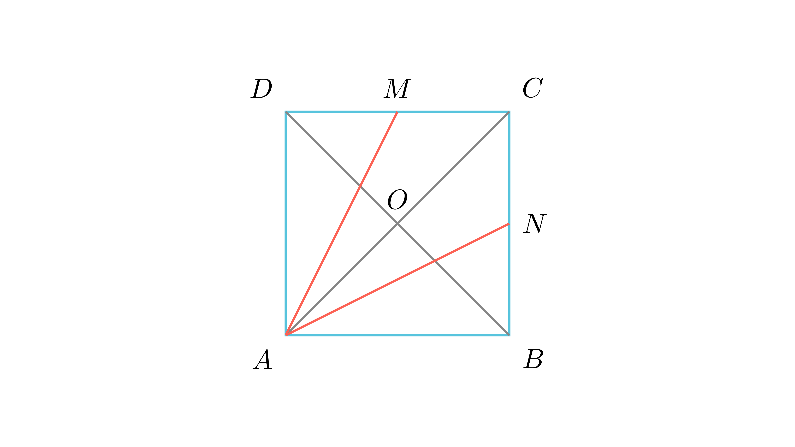

# Поделба на дијагонала во квадрат

## Текст на задачата
Даден е квадрат $ABCD$. Темето $A$ е поврзано со точките $M$ и $N$, кои се средини на страните $CD$ и $BC$, соодветно. Да се докаже дека дијагоналата $BD$ со отсечките $AM$ и $AN$ поделена е на три еднакви делови.

## 📐 Скица / Конструкција
<Опис на цртежот. Кои се клучните точки? Дали има помошни линии?>

  

## 🧠 Анализа
Разгледај ги триаголниците $ABC$ и $ACD$. Пресечните точки на отсечките со дијагоналата се всушност нивните тежишта.

## 📝 Решение (СИНТЕТИЧКО)
1. Нека $O$ е центарот на квадратот. $BO$ е медијана во $\triangle ABC$. 
2. Бидејќи $N$ е средина на $BC$, $AN$ е исто така медијана. Пресекот $P$ на $AN$ и $BD$ е тежиште на $\triangle ABC$. 
3. Според својство на тежиште, $BP = \frac{2}{3}BO$. Бидејќи $BO = \frac{1}{2}BD$, следува $BP = \frac{1}{3}BD$. 
4. Аналогно во $\triangle ACD$, пресекот $Q$ на $AM$ и $BD$ е тежиште, па $DQ = \frac{1}{3}BD$. 
5. Средниот дел е $PQ = BD - \frac{1}{3}BD - \frac{1}{3}BD = \frac{1}{3}BD$.

## ⚠️ Аналитички пристап (само ако е неизбежен)
<Ако мора да се користат координати, објасни зошто синтетичкиот пат е претежок.>

## 🏁 Заклучок
Видете го решението погоре.