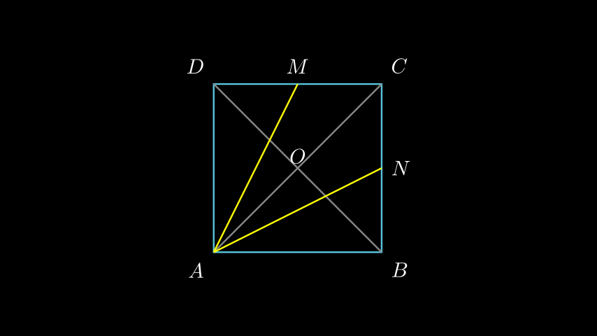

# Problem
Given a square $ABCD$. Vertex $A$ is connected to points $M$ and $N$, which are the midpoints of sides $CD$ and $BC$, respectively. Prove that the diagonal $BD$ is divided into three equal parts by the segments $AM$ and $AN$.

# Solution
Let $P$ be the intersection of $AM$ and $BD$, and $Q$ be the intersection of $AN$ and $BD$.
We need to prove that $DP = PQ = QB$.

Consider $\triangle ACD$.
$AM$ is a median of $\triangle ACD$ because $M$ is the midpoint of $CD$.
The diagonal $BD$ intersects $AC$ at $O$, which is the midpoint of $AC$.
Thus, $DO$ is also a median of $\triangle ACD$.
The intersection point $P$ of the medians $AM$ and $DO$ is the centroid of $\triangle ACD$.
By the property of the centroid, $P$ divides the median $DO$ in the ratio $2:1$ from the vertex $D$.
However, we are interested in the segment $DP$ on the diagonal $BD$.
Wait, $P$ lies on $DO$. $DO = \frac{1}{2}BD$.
The centroid divides the median in ratio $2:1$. So $DP = \frac{2}{3} DO$.
Substituting $DO = \frac{1}{2}BD$:
$$DP = \frac{2}{3} \cdot \frac{1}{2} BD = \frac{1}{3} BD$$

Similarly, consider $\triangle ABC$.
$AN$ is a median of $\triangle ABC$ because $N$ is the midpoint of $BC$.
$BO$ is a median of $\triangle ABC$ because $O$ is the midpoint of $AC$.
The intersection point $Q$ of the medians $AN$ and $BO$ is the centroid of $\triangle ABC$.
Therefore, $Q$ divides the median $BO$ in the ratio $2:1$ from the vertex $B$.
$$BQ = \frac{2}{3} BO$$
Substituting $BO = \frac{1}{2}BD$:
$$BQ = \frac{2}{3} \cdot \frac{1}{2} BD = \frac{1}{3} BD$$

Now we have $DP = \frac{1}{3} BD$ and $BQ = \frac{1}{3} BD$.
The remaining segment $PQ$ is:
$$PQ = BD - DP - BQ = BD - \frac{1}{3} BD - \frac{1}{3} BD = \frac{1}{3} BD$$

Thus, $DP = PQ = QB = \frac{1}{3} BD$.
The diagonal $BD$ is divided into three equal parts.

## 💡 Решение

### Метод 1: Сличност на триаголници
Нека $P$ е пресечната точка на $AM$ и $BD$, а $Q$ е пресечната точка на $AN$ и $BD$.

1.  **Разгледуваме $\triangle ABP$ и $\triangle MDP$:**
    Бидејќи $AB \parallel CD$ (страни на квадрат), следува дека $\triangle ABP \sim \triangle MDP$.
    Коефициентот на сличност е $k = \frac{AB}{DM} = \frac{AB}{AB/2} = 2$.
    Оттука $\frac{BP}{DP} = 2 \implies BP = 2DP$.
    Бидејќи $BP + DP = BD$, следува $3DP = BD \implies DP = \frac{1}{3}BD$.

2.  **Разгледуваме $\triangle ADQ$ и $\triangle NBQ$:**
    Бидејќи $AD \parallel BC$, следува дека $\triangle ADQ \sim \triangle NBQ$.
    Коефициентот на сличност е $k = \frac{AD}{BN} = \frac{AD}{AD/2} = 2$.
    Оттука $\frac{DQ}{BQ} = 2 \implies DQ = 2BQ$.
    Бидејќи $DQ + BQ = BD$, следува $3BQ = BD \implies BQ = \frac{1}{3}BD$.

3.  **Заклучок:**
    $DP = \frac{1}{3}BD$ и $BQ = \frac{1}{3}BD$.
    $PQ = BD - DP - BQ = BD - \frac{1}{3}BD - \frac{1}{3}BD = \frac{1}{3}BD$.
    Значи, $DP = PQ = QB$.

### Метод 2: Тежиште на триаголник
1.  Нека $O$ е пресекот на дијагоналите $AC$ и $BD$. Тогаш $O$ е средина на $AC$.
2.  Во триаголникот $ABC$, отсечката $BO$ е тежишна линија (бидејќи $O$ е средина на $AC$).
3.  Отсечката $AN$ е исто така тежишна линија (бидејќи $N$ е средина на $BC$).
4.  Нивниот пресек $Q$ е тежиште на $\triangle ABC$.
5.  Тежиштето ја дели тежишната линија во однос $2:1$ од темето.
    Значи, $BQ = \frac{2}{3} BO$.
    Бидејќи $BO = \frac{1}{2} BD$, имаме $BQ = \frac{2}{3} \cdot \frac{1}{2} BD = \frac{1}{3} BD$.
6.  Аналогно, во триаголникот $ACD$, $P$ е тежиште (пресек на $DO$ и $AM$).
    $DP = \frac{2}{3} DO = \frac{2}{3} \cdot \frac{1}{2} BD = \frac{1}{3} BD$.
7.  Останува $PQ = \frac{1}{3} BD$.