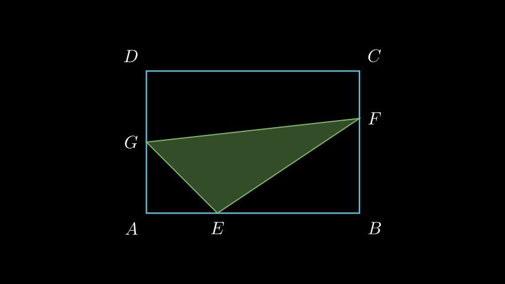

# Плоштина на впишан триаголник во правоаголник

## Текст на задачата
Во правоаголник $ABCD$ со периметар $60$ cm, важи $BC = \frac{2}{3}AB$. На страната $AB$ дадена е точка $E$ така што $AE = \frac{1}{3}AB$, а на страната $BC$ дадена е точка $F$ така што $BF = \frac{2}{3}BC$. Ако точката $G$ е средина на отсечката $AD$, колку изнесува плоштината на триаголникот $EFG$?

## 📐 Скица / Конструкција

## 💡 Решение

1.  **Одредување на страните на правоаголникот:**
    Периметарот е $L = 2(AB + BC) = 60$, па $AB + BC = 30$.
    Дадено е $BC = \frac{2}{3}AB$.
    Заменуваме во равенката:
    $$ AB + \frac{2}{3}AB = 30 $$
    $$ \frac{5}{3}AB = 30 \implies AB = 30 \cdot \frac{3}{5} = 18 \text{ cm} $$
    $$ BC = \frac{2}{3} \cdot 18 = 12 \text{ cm} $$
    Плоштината на правоаголникот е $P_{ABCD} = 18 \cdot 12 = 216 \text{ cm}^2$.

2.  **Одредување на положбата на точките:**
    *   $AE = \frac{1}{3}AB = \frac{1}{3} \cdot 18 = 6$. Тогаш $EB = 18 - 6 = 12$.
    *   $BF = \frac{2}{3}BC = \frac{2}{3} \cdot 12 = 8$. Тогаш $FC = 12 - 8 = 4$.
    *   $G$ е средина на $AD$, па $AG = GD = \frac{1}{2}AD = \frac{1}{2} \cdot 12 = 6$.

3.  **Пресметка на плоштината на $\triangle EFG$:**
    Од плоштината на правоаголникот ги одземаме плоштините на фигурите во ќошевите:
    *   $\triangle AGE$ (правоаголен кај $A$):
        $$ P_{AGE} = \frac{1}{2} \cdot AG \cdot AE = \frac{1}{2} \cdot 6 \cdot 6 = 18 $$
    *   $\triangle EBF$ (правоаголен кај $B$):
        $$ P_{EBF} = \frac{1}{2} \cdot EB \cdot BF = \frac{1}{2} \cdot 12 \cdot 8 = 48 $$
    *   Трапез $GDCF$ (прав агол кај $D$ и $C$, висина $DC$):
        Основи се $GD=6$ и $FC=4$. Висината е $DC=AB=18$.
        $$ P_{GDCF} = \frac{GD + FC}{2} \cdot DC = \frac{6 + 4}{2} \cdot 18 = 5 \cdot 18 = 90 $$

    Вкупната плоштина што се одзема е:
    $$ P_{sub} = 18 + 48 + 90 = 156 $$

    Плоштината на $\triangle EFG$ е:
    $$ P_{EFG} = P_{ABCD} - P_{sub} = 216 - 156 = 60 \text{ cm}^2 $$

Конечниот резултат е $60 \text{ cm}^2$.