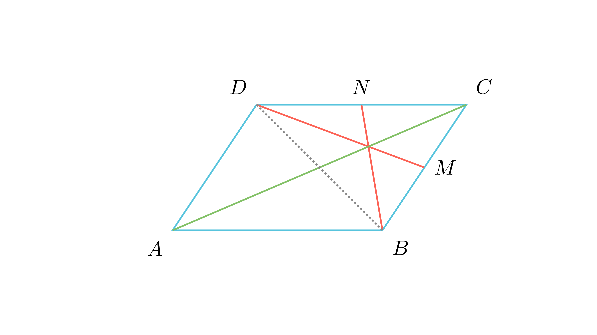

# Конкурентност на тежишни линии во паралелограм

## Текст на задачата
Даден е паралелограм $ABCD$. Нека $M$ и $N$ се средини на страните $BC$ и $CD$, соодветно. Докажи дека правите $DM$ и $BN$ се сечат во точка која лежи на дијагоналата $AC$.

## 📐 Скица / Конструкција

{ width=500 }

{ width=500 }
## 🧠 Анализа
Префрли го фокусот од целиот паралелограм на триаголникот $BCD$. Што се всушност правите $DM$ и $BN$ за тој триаголник?

## 📝 Решение (СИНТЕТИЧКО)
1. **Триаголник BCD:** Разгледај го $\triangle BCD$. 
2. **Медијани:** Бидејќи $M$ и $N$ се средини на $BC$ и $CD$, отсечките $DM$ и $BN$ се тежишни линии (медијани) во $\triangle BCD$. 
3. **Тежиште:** Нивниот пресек, точката $T$, е тежиште на $\triangle BCD$. 
4. **Трета медијана:** Третата тежишна линија поаѓа од $C$ и минува низ средината на $BD$. 
5. **Дијагонали:** Бидејќи дијагоналите во паралелограм се половат, пресекот $O$ на $AC$ и $BD$ е токму средината на $BD$. 
6. **Колинеарност:** Значи, $CO$ е третата медијана и таа минува низ $T$. Бидејќи $CO$ е дел од дијагоналата $AC$, точката $T$ лежи на $AC$.

## ⚠️ Аналитички пристап (само ако е неизбежен)
<Ако мора да се користат координати, објасни зошто синтетичкиот пат е претежок.>

## 🏁 Заклучок
Видете го решението погоре.