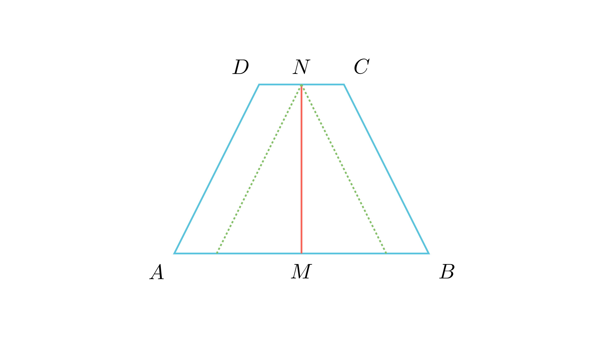

# Агли на основа во специфичен трапез

## Текст на задачата
Даден е трапез $ABCD$ со основи $AB=a, CD=b, a>b$. Нека $M$ и $N$ се средини на основите $AB$ и $CD$, соодветно, и нека $MN = \frac{a-b}{2}$. Пресметај го збирот на аглите на поголемата основа.

## 📐 Скица / Конструкција

  

## 🧠 Анализа
Транслирај ги краците низ точката $N$ за да формираш триаголник чија основа е $a-b$.

## 📝 Решение (СИНТЕТИЧКО)
1. Низ $N$ повлечи паралели со краците до пресек со $AB$ во $P$ и $Q$. 
2. $PQ = a - \frac{b}{2} - \frac{b}{2} = a-b$. 
3. Бидејќи $M$ е средина на $AB$, таа е и средина на $PQ$, па $PM = MQ = \frac{a-b}{2}$. 
4. Во $\triangle PNQ$, $NM$ е медијана и $NM = \frac{a-b}{2}$, што значи $NM = \frac{1}{2}PQ$. 
5. Ова својство важи само за правоаголен триаголник, па $\angle PNQ = 90^\circ$. 
6. Збирот на аглите на основата е $180 - 90 = 90^\circ$.

## ⚠️ Аналитички пристап (само ако е неизбежен)
<Ако мора да се користат координати, објасни зошто синтетичкиот пат е претежок.>

## 🏁 Заклучок
Видете го решението погоре.